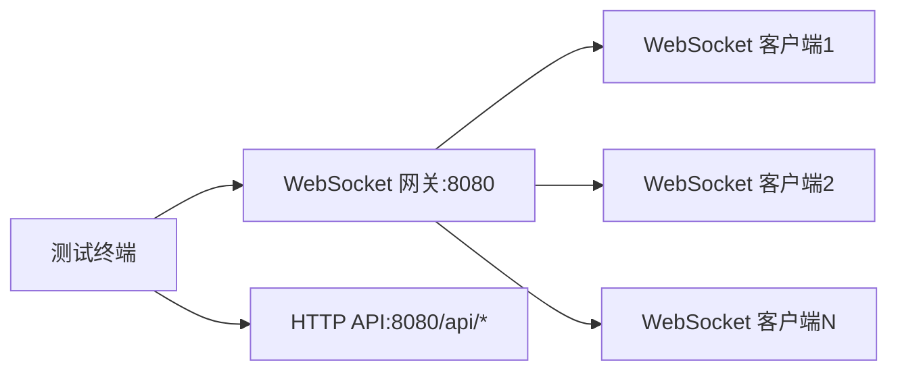

# **Go轻量级WebSocket网关 – 用户验收测试计划**

---

> **项目名称**：se-go-ws-gateway-2026
>
> **版本**：v1.0
>
> **日期**：2026-08-06
>
> **编写人**：刘灿阳

---

[TOC]

---

## 一、引言

用户验收测试（UAT）是软件交付前由用户或客户代表执行的最终测试，旨在确认系统是否满足业务需求、功能规格和性能预期。本计划定义了 Go 轻量级 WebSocket 网关项目的用户验收测试范围、方法、环境和通过标准。

---

## 二、测试目标

- 验证所有核心功能（WebSocket 连接管理、三种消息推送模式、限流防护、优雅退出）符合需求规格说明书。
- 确认系统在高并发下的性能指标（并发连接数、P99 延迟、消息送达率）达到预期标准。
- 检验安全防护措施（限流、参数校验、重复连接拒绝）的有效性。
- 收集用户反馈，为最终上线提供依据。

---

## 三、测试范围

| 测试类型 | 覆盖内容 |
| -------- | -------- |
| 功能验证 | WebSocket 连接建立/注册/注销、心跳保活、全服广播/房间广播/单播、限流防护、优雅退出、统计接口、健康检查 |
| 性能验证 | 并发连接数、广播延迟（P50/P95/P99）、消息送达率、HTTP 接口吞吐量 |
| 安全性验证 | 限流防刷、特殊字符过滤、重复 clientId 拒绝 |

---

## 四、测试环境

### 4.1 硬件配置

| 组件 | 规格 |
| ---- | ---- |
| CPU | 12th Gen Intel(R) Core(TM) i5-12450H（8核12线程） |
| 内存 | 16GB DDR5 |
| 网络 | 本地回环（127.0.0.1） |

### 4.2 软件配置

| 软件 | 版本/说明 |
| ---- | --------- |
| 操作系统 | Windows 11 专业版 |
| Go 编译器 | go 1.26.4（64位） |
| 被测服务 | se-go-ws-gateway-2026（WebSocket 网关） |
| 测试工具 | 自定义 `loadtest`、`hey`（HTTP 压测）、`curl`、浏览器控制台/wstool |

### 4.3 网络拓扑

---

## 五、测试角色与职责

| 角色 | 职责 |
| ---- | ---- |
| 测试负责人 | 制定测试计划、准备测试环境、协调测试资源、审核测试报告 |
| 测试执行者 | 执行测试用例、记录测试结果、提交缺陷 |
| 客户代表 | 确认测试用例、参与验收、签署验收报告 |

---

## 六、测试用例设计

### 6.1 功能测试用例

| 编号 | 测试项 | 操作步骤 | 预期结果 |
| ---- | ------ | -------- | -------- |
| **WebSocket 连接与心跳** | | | |
| FT-01 | WebSocket 连接建立 | 浏览器控制台/wstool 连接 `ws://localhost:8080/ws?clientId=test&roomId=room1` | 连接成功，服务端输出注册成功日志 |
| FT-02 | 心跳保活 | 连接后等待 30 秒，观察服务端日志 | Ping/Pong 成对出现 |
| FT-03 | 参数缺失拒绝 | 浏览器控制台执行 `new WebSocket("ws://localhost:8080/ws?clientId=test&roomId=")`，监听 onclose 事件 | 连接关闭，状态码 4000，关闭原因提示参数缺失 |
| FT-04 | 特殊字符拒绝 | `clientId=test.` 或 `roomId=room!` 连接 | 连接关闭，状态码 4001，提示格式无效 |
| FT-05 | 重复 clientId 拒绝 | 先连接 test1，再连接相同 clientId | 第二次连接关闭，状态码 4002，提示 clientId 已存在 |
| **消息路由** | | | |
| FT-06 | 全服广播 | `curl -X POST http://localhost:8080/api/broadcast -H "Content-Type: application/json" -d '{"type":"text","data":"hello"}'` | 返回 200，所有在线客户端收到消息 |
| FT-07 | 房间广播 | `curl -X POST "http://localhost:8080/api/room/room1/broadcast" -H "Content-Type: application/json" -d '{"type":"text","data":"hello"}'` | 返回 200，仅 room1 客户端收到消息 |
| FT-08 | 房间不存在 | `curl -X POST "http://localhost:8080/api/room/nonexistent/broadcast" -H "Content-Type: application/json" -d '{"type":"text","data":"hello"}'` | 返回 404，提示目标房间不存在 |
| FT-09 | 单播（在线） | `curl -X POST http://localhost:8080/api/client/test/send -H "Content-Type: application/json" -d '{"type":"text","data":"hello"}'` | 返回 200，指定客户端收到消息 |
| FT-10 | 单播（离线） | `curl -X POST http://localhost:8080/api/client/offline/send -H "Content-Type: application/json" -d '{"type":"text","data":"hello"}'` | 返回 404，提示目标客户端离线或不存在 |
| **HTTP API 校验** | | | |
| FT-11 | 请求体为空 | `curl -X POST http://localhost:8080/api/broadcast -H "Content-Type: application/json" -d ''` | 返回 400，提示请求体不能为空 |
| FT-12 | 请求体非 JSON | `curl -X POST http://localhost:8080/api/broadcast -H "Content-Type: application/json" -d 'plain text'` | 返回 400，提示无效的 JSON 格式 |
| FT-13 | 请求体为纯数字 | `curl -X POST http://localhost:8080/api/broadcast -d '12345'` | 返回 400，提示无效的 JSON 格式 |
| FT-14 | roomId 路径参数缺失 | `curl -X POST http://localhost:8080/api/room//broadcast -H "Content-Type: application/json" -d '{"type":"text","data":"hello"}'` | 返回 400，提示 roomId is required |
| FT-15 | clientId 路径参数缺失 | `curl -X POST http://localhost:8080/api/client//send -H "Content-Type: application/json" -d '{"type":"text","data":"hello"}'` | 返回 400，提示 clientId is required |
| **限流** | | | |
| FT-16 | 限流触发 | 快速连续发送 6 次广播请求 | 前 5 次成功（桶容量 5），第 6 次返回 429 |
| **统计与监控** | | | |
| FT-17 | 连接统计 | `curl http://localhost:8080/api/stats` | 返回总连接数、各房间连接数、运行时长 |
| FT-18 | 健康检查 | `curl http://localhost:8080/health` | 返回 `{"status":"ok"}` |
| FT-19 | Prometheus 指标 | `curl http://localhost:8080/metrics` | 返回包含 `ws_active_connections` 等指标 |
| **优雅退出** | | | |
| FT-20 | 优雅退出（Ctrl+C） | 连接 2 个客户端后按 Ctrl+C | 所有连接收到 1000 正常关闭，注销日志输出 |
| FT-21 | 优雅退出（SIGTERM） | 在 Linux 环境执行 `kill <PID>` | 同 FT-20 |

### 6.2 性能测试用例

| 编号 | 测试项 | 测试方法 | 通过标准 |
| ---- | ------ | -------- | -------- |
| PT-01 | 连接建立性能 | `go run cmd/loadtest/main.go -num 1000` | 1000 连接建立时间 < 5s，成功率 ≥ 99.9% |
| PT-02 | 广播延迟（2000 并发） | `go run cmd/loadtest/main.go -num 2000` | P99 延迟 < 50ms，消息送达率 ≥ 99.9% |
| PT-03 | 广播延迟（5000 并发） | `go run cmd/loadtest/main.go -num 5000` | P99 延迟 < 80ms（极限验证），消息送达率 ≥ 99.9% |
| PT-04 | 混合负载 | 修改 loadtest 启用上行消息，同时触发广播 | P99 延迟 < 50ms（2000 并发），错误率 0% |
| PT-05 | HTTP 接口吞吐量 | `hey -n 100000 -c 200 -m POST -H "Content-Type: application/json" -d '{"type":"text","data":"load"}' http://localhost:8080/api/broadcast` | QPS ≥ 10,000，P99 延迟 < 50ms，错误率 < 1% |
| PT-06 | 长时间稳定性 | `go run cmd/loadtest/main.go -num 1000` 保持连接，每 30 秒触发广播，持续 30 分钟 | 无内存泄漏，无连接中断，广播成功率 100% |

### 6.3 安全测试用例

| 编号 | 测试项 | 操作步骤 | 预期结果 |
| ---- | ------ | -------- | -------- |
| ST-01 | 限流防刷 | 快速连续发送 6 次 POST 请求 | 前 5 次成功，第 6 次返回 429 |
| ST-02 | clientId 特殊字符 | 使用 `clientId=test.` 连接 | 连接关闭，状态码 4001 |
| ST-03 | roomId 特殊字符 | 使用 `roomId=room!` 连接 | 连接关闭，状态码 4001 |
| ST-04 | 重复 clientId 并发 | 同时发起多个相同 clientId 的连接 | 仅 1 个成功，其余被拒绝（状态码 4002） |

---

## 七、测试执行流程

1. **准备阶段**：搭建测试环境，启动 WebSocket 网关服务（`go run cmd/gateway/main.go`）。
2. **执行阶段**：按顺序执行 FT→PT→ST 测试用例，记录实际结果，保存原始输出文件。
3. **问题处理**：对发现的问题分类，开发修复后回归测试。
4. **验收报告**：汇总测试结果，生成用户验收测试报告，客户代表签署。

---

## 八、通过标准

- **功能测试**：所有 FT 用例 100% 通过。
- **性能测试**：
  - 2000 并发下 P99 延迟 < 50ms，消息送达率 ≥ 99.9%。
  - HTTP 接口 QPS ≥ 10,000，错误率 < 1%。
  - 长时间运行无内存泄漏，连接稳定。
- **安全测试**：所有 ST 用例通过，限流和输入校验有效。

---

## 九、交付物

1. 用户验收测试报告
2. 原始测试数据文件（loadtest 输出、hey 输出）
3. 测试截图（浏览器控制台、wstool 等）

---

**版本记录**

| 版本 | 日期 | 修改说明 |
| ---- | ---- | -------- |
| v1.0 | 2026-08-06 | 初始版本 |