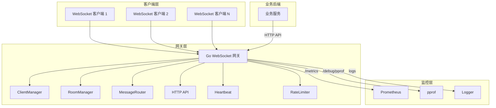
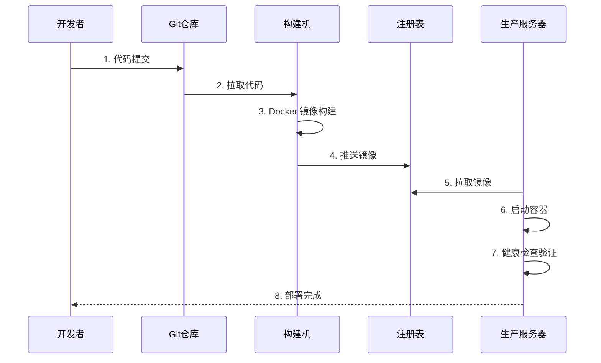

# **Go轻量级WebSocket网关 – 部署计划**

---

> **项目名称**：se-go-ws-gateway-2026
>
> **版本**：v1.0
>
> **日期**：2026-08-07
>
> **编写人**：刘灿阳

---

[TOC]

---

## 一、引言

### 1.1 部署计划目的

本计划旨在标准化 Go 轻量级 WebSocket 网关的生产环境部署流程，明确从环境准备、容器化构建、安全部署到监控运维的全流程规范，确保网关在生产环境中具备**高可用性、高安全性、高性能**的运行状态，同时降低运维成本、提升故障响应效率。

### 1.2 部署范围与核心目标

| 维度 | 范围说明 | 核心目标 |
|------|----------|----------|
| 环境覆盖 | 开发环境、测试环境、生产环境 | 环境一致性：确保各环境依赖、配置逻辑统一 |
| 部署内容 | Docker 容器化构建、配置管理、服务编排、监控运维 | 性能达标：单机支持 5000 并发长连接，P99 延迟 < 50ms |
| 运维覆盖 | 监控告警、故障处理、版本更新、日常维护 | 可用性保障：服务故障恢复时间 ≤ 10 分钟 |

### 1.3 术语表

| 术语 | 说明 |
|------|------|
| WebSocket 网关 | 本项目的核心服务，负责管理 WebSocket 长连接并提供消息推送能力 |
| Docker | 容器化平台，用于打包和运行应用程序 |
| Docker Compose | 容器编排工具，用于定义和运行多容器应用 |
| Prometheus | 监控系统，用于采集和存储指标数据 |
| pprof | Go 语言性能分析工具，用于 CPU 和内存 profiling |
| Config.toml | 网关的配置文件，采用 TOML 格式 |

---

## 二、系统概述

### 2.1 技术栈与核心架构

| 核心组件 | 技术选型 | 核心作用 |
|----------|----------|----------|
| 开发语言 | Go 1.26.4 | 提供高并发、内存安全的运行环境 |
| Web 框架 | Gin | HTTP 路由管理和 API 服务 |
| WebSocket | gorilla/websocket | WebSocket 协议实现，长连接管理 |
| 配置管理 | BurntSushi/toml | 配置文件解析 |
| 监控指标 | Prometheus | 暴露 `/metrics` 端点，采集运行指标 |
| 性能分析 | net/http/pprof | CPU 和内存 Profile 采集 |
| 日志系统 | slog | 结构化日志输出（JSON 格式） |
| 容器化 | Docker + Docker Compose | 镜像构建和容器编排 |

### 2.2 核心功能模块

| 模块 | 功能说明 |
|------|----------|
| **连接管理器（ClientManager）** | 管理所有 WebSocket 长连接的注册、注销、查询和优雅关闭 |
| **房间管理器（RoomManager）** | 维护房间与客户端的关联关系，支持加入/离开/查询 |
| **消息路由器（MessageRouter）** | 实现全服广播、房间广播、单播三种消息推送模式 |
| **HTTP API 处理器** | 提供 `/api/broadcast`、`/api/room/:roomId/broadcast`、`/api/client/:clientId/send` 等管理接口 |
| **心跳保活** | 基于 Ping/Pong 机制维持连接活跃 |
| **限流防护** | 基于 IP 的令牌桶限流，保护网关免受高频请求冲击 |
| **优雅退出** | 捕获 SIGINT/SIGTERM 信号，安全关闭所有连接和协程 |
| **监控指标** | 暴露 Prometheus 指标和 pprof 性能分析端点 |

### 2.3 架构图



---

## 三、部署前准备

### 3.1 硬件需求

| 组件 | 最低配置 | 推荐配置 | 说明 |
|------|----------|----------|------|
| CPU | 2 核 | 4 核+ | Go 的 goroutine 调度需要多核支持 |
| 内存 | 4 GB | 8 GB+ | 5000 长连接约需 150MB，留有余量 |
| 存储 | 20 GB | 50 GB+ | 日志、镜像存储空间 |
| 网络 | 1 Gbps | 1 Gbps+ | 高并发场景需保证网络带宽 |

### 3.2 软件依赖

| 软件 | 最低版本 | 说明 |
|------|----------|------|
| Go | 1.26.4 | 编译运行环境 |
| Docker | 24.0+ | 容器运行时 |
| Docker Compose | 2.20+ | 容器编排工具 |
| Git | 2.0+ | 代码管理 |
| Linux 内核 | 5.4+ | 生产环境推荐 Linux（Ubuntu 22.04 / CentOS 9） |

**环境检查命令：**
```bash
go version        # 确认 Go 版本 >= 1.26.4
docker version    # 确认 Docker 版本
docker-compose version  # 确认 Compose 版本
ulimit -n         # 确认文件描述符限制 >= 65535
```

### 3.3 系统调优配置

| 配置项 | 推荐值 | 说明 |
|--------|--------|------|
| `ulimit -n` | 65535 | 最大文件描述符数 |
| `net.core.somaxconn` | 65535 | TCP 监听队列大小（Linux） |
| `net.ipv4.tcp_tw_reuse` | 1 | 快速回收 TIME_WAIT 连接（Linux） |
| `net.ipv4.ip_local_port_range` | 1024 65000 | 临时端口范围（Linux） |

### 3.4 安全准备

| 项目 | 说明 |
|------|------|
| 防火墙规则 | 开放 8080（网关）、6060（pprof，可选） |
| 配置文件权限 | `config.toml` 含敏感配置，建议限制读取权限 |
| 日志目录权限 | 确保网关进程有写入权限 |
| 安全组 | 生产环境仅开放必要端口，限制公网访问 |

---

## 四、容器化部署

### 4.1 Dockerfile 设计

采用**多阶段构建**策略，减少最终镜像大小并提高构建效率。

```dockerfile
# ==========================================
# 第一阶段：构建阶段（builder）
# ==========================================
FROM golang:1.26.4-alpine AS builder

WORKDIR /app

# 复制依赖文件并下载
COPY go.mod go.sum ./

RUN go env -w GOPROXY=https://goproxy.cn,direct && \
	go env -w GOSUMDB=sum.golang.google.cn

RUN go mod download

# 复制源代码并编译
COPY . ./

RUN CGO_ENABLED=0 GOOS=linux go build -ldflags="-s -w" -o gateway ./cmd/gateway

# ==========================================
# 第二阶段：运行阶段（最终镜像）
# ==========================================
FROM alpine:latest

# 安装根证书（用于 HTTPS 请求）
RUN apk add --no-cache ca-certificates

WORKDIR /app

# 从构建阶段复制二进制文件
COPY --from=builder /app/gateway ./

# 复制配置文件（使用默认配置）
COPY ./configs/config.toml ./configs/

# 创建日志目录
RUN mkdir -p ./logs

# 暴露端口（业务 + pprof）
EXPOSE 8080 6060

# 健康检查
HEALTHCHECK --interval=30s --timeout=3s --start-period=10s --retries=3 \
  CMD wget --no-verbose --tries=1 --spider http://localhost:8080/health || exit 1

CMD ["./gateway"]
```

**设计要点说明：**

| 设计决策 | 说明 |
|----------|------|
| `alpine` 基础镜像 | 约 5MB，大幅减少镜像体积 |
| `CGO_ENABLED=0` | 静态编译，避免 glibc 依赖问题 |
| 多阶段构建 | 分离构建环境和运行环境，减少镜像体积 |
| 健康检查 | 利用 `/health` 端点实现容器健康检查 |
| 时区支持 | 安装 `tzdata`，保证日志时间正确 |

### 4.2 Docker Compose 编排

使用 Docker Compose 定义网关服务及依赖组件。

```yaml
# docker-compose.yml
version: '3.8'

services:
  gateway:
    build: .
    container_name: ws-gateway
    ports:
      - "8080:8080"   # HTTP API / WebSocket
      - "6060:6060"   # pprof 调试（可选，生产环境可关闭）
    environment:
      # 环境变量覆盖配置（优先级高于 config.toml）
      - WS_PORT=8080
      - WS_PING_INTERVAL=30
      - WS_PONG_WAIT=60
      - WS_SHUTDOWN_TIMEOUT=5
      # 日志级别：生产环境建议 error
      - WS_LOG_LEVEL=error
    volumes:
      # 日志持久化
      - ./logs:/app/logs
      # 配置文件挂载（便于动态修改）
      - ./configs/config.toml:/app/configs/config.toml:ro
    restart: unless-stopped
    networks:
      - gateway-net
    logging:
      driver: "json-file"
      options:
        max-size: "10m"
        max-file: "3"

  # 可选：Prometheus 监控
  prometheus:
    image: prom/prometheus:latest
    container_name: ws-prometheus
    ports:
      - "9090:9090"
    volumes:
      - ./prometheus.yml:/etc/prometheus/prometheus.yml:ro
      - prometheus-data:/prometheus
    networks:
      - gateway-net
    command:
      - '--config.file=/etc/prometheus/prometheus.yml'
      - '--storage.tsdb.path=/prometheus'

networks:
  gateway-net:
    driver: bridge

volumes:
  prometheus-data:
```

### 4.3 Prometheus 配置示例

```yaml
# prometheus.yml
global:
  scrape_interval: 15s
  evaluation_interval: 15s

scrape_configs:
  - job_name: 'ws-gateway'
    static_configs:
      - targets: ['gateway:8080']
    metrics_path: '/metrics'
```

### 4.4 环境变量配置

| 环境变量 | 对应配置 | 说明 |
|----------|----------|------|
| `WS_PORT` | `server.port` | 监听端口 |
| `WS_PING_INTERVAL` | `heartbeat.ping_interval_seconds` | Ping 间隔（秒） |
| `WS_PONG_WAIT` | `heartbeat.pong_wait_seconds` | Pong 超时（秒） |
| `WS_SHUTDOWN_TIMEOUT` | `graceful_shutdown.timeout_seconds` | 优雅退出宽限期（秒） |
| `WS_LOG_LEVEL` | `log.level` | 日志级别（debug/info/warn/error） |

> **优先级**：环境变量 > 配置文件 `config.toml` > 默认值

---

## 五、部署步骤

### 5.1 部署流程图



### 5.2 详细操作步骤

#### 步骤 1：代码准备
```bash
# 克隆代码
git clone https://github.com/alac19/se-go-ws-gateway-2026.git
cd se-go-ws-gateway-2026

# 确认代码版本
git checkout main
```

#### 步骤 2：构建 Docker 镜像
```bash
# 构建镜像
docker build -t se-go-ws-gateway:v1.0 .

# 验证镜像（Linux）
docker images | grep se-go-ws-gateway

# 验证镜像（Windows）
docker images | findstr se-go-ws-gateway
```

#### 步骤 3：启动服务
```bash
# 使用 Docker Compose 一键启动
docker-compose up -d

# 查看运行状态
docker-compose ps
```

#### 步骤 4：验证服务

| 验证项 | 命令 | 预期结果 |
|--------|------|----------|
| 健康检查 | `curl http://localhost:8080/health` | `{"status":"ok"}` |
| 指标端点 | `curl http://localhost:8080/metrics` | 返回 Prometheus 格式指标 |
| WebSocket 连接 | `wscat -c "ws://localhost:8080/ws?clientId=test&roomId=room1"` | 连接成功 |
| 广播测试 | `curl -X POST http://localhost:8080/api/broadcast -H "Content-Type: application/json" -d '{"type":"text","data":"hello"}'` | 返回 200 |

#### 步骤 5：查看日志
```bash
# 查看网关日志
docker-compose logs -f gateway

# 查看最近 100 行
docker-compose logs --tail=100 gateway
```

---

## 六、监控与运维

### 6.1 监控指标

| 监控维度 | 关键指标 | 告警阈值 | 采集方式 |
|----------|----------|----------|----------|
| **连接数** | `ws_active_connections` | > 5000 持续 5 分钟 | Prometheus |
| **消息吞吐** | `ws_gateway_msg_sent_total` | 突降 > 50% | Prometheus |
| **消息失败** | `ws_gateway_msg_send_fail_total` | 错误率 > 1% | Prometheus |
| **连接事件** | `ws_connection_events_total` | 突增 > 100% | Prometheus |
| **进程状态** | 进程存活 | 进程退出 | Systemd + 告警 |
| **端口监听** | 8080 端口 | 端口未监听 | 健康检查 |

> 说明：上述告警规则为生产环境规划标准。当前部署环境为开发/测试阶段，告警系统未实际部署，运维人员可根据实际需求启用。

### 6.2 日志管理

| 配置项 | 推荐值 | 说明 |
|--------|--------|------|
| 日志级别 | `error`（生产）/ `info`（开发） | 避免高并发下日志 I/O 成为瓶颈 |
| 日志格式 | JSON | 便于采集和检索 |
| 日志轮转 | 10MB × 3 文件 | 避免磁盘占满 |
| 日志保留 | 7 天 | 满足排障需求 |

### 6.3 健康检查机制

```yaml
# Docker Compose 健康检查配置
healthcheck:
  test: ["CMD", "wget", "--no-verbose", "--tries=1", "--spider", "http://localhost:8080/health"]
  interval: 30s
  timeout: 3s
  retries: 3
  start_period: 10s
```

### 6.4 故障处理规范

| 故障类型 | 应急处理步骤 | 预防措施 |
|----------|--------------|----------|
| **服务进程退出** | 1. 检查容器状态；2. 查看 ERROR 日志；3. 重启容器 | 配置 `restart: unless-stopped` |
| **连接数突增** | 1. 检查限流配置；2. 查看是否遭受攻击；3. 临时扩容 | 配置限流和告警 |
| **内存持续增长** | 1. 采集 pprof heap；2. 分析内存泄漏；3. 重启服务 | 定期监控 + pprof 排查 |
| **CPU 持续高位** | 1. 采集 pprof profile；2. 分析热点函数；3. 优化代码 | 定期压测 + 性能调优 |

---

## 七、回滚策略

### 7.1 版本管理

| 策略 | 说明 |
|------|------|
| 镜像 Tag | 使用语义化版本：`v1.0.0`、`v1.0.1` |
| 环境 Tag | 开发：`dev-latest`，生产：`prod-stable` |
| 版本锁定 | 生产环境使用明确版本 Tag，避免使用 `latest` |

### 7.2 回滚步骤

1. **停止当前容器**
   ```bash
   docker-compose down
   ```

2. **恢复指定版本镜像**
   ```bash
   docker-compose up -d --no-build
   ```

3. **验证服务**
   ```bash
   curl http://localhost:8080/health
   ```

4. **确认回滚完成**：检查日志和业务反馈

### 7.3 回滚测试结果

| 测试项 | 结果 | 耗时 |
|--------|------|------|
| 容器停止 | ✅ | < 5s |
| 旧版本启动 | ✅ | < 10s |
| 健康检查通过 | ✅ | < 5s |
| WebSocket 连接恢复 | ✅ | < 10s |

---

## 八、未来优化方向

### 8.1 Kubernetes 迁移

当前使用 Docker Compose 进行单机部署，未来可迁移至 Kubernetes 集群，实现：

- **弹性扩缩容**：根据 CPU/内存自动调整 Pod 数量
- **滚动更新**：零停机更新版本
- **故障自愈**：自动重启失败的 Pod

### 8.2 CI/CD 流水线

接入 GitHub Actions 或 GitLab CI，实现：

- 代码提交 → 自动编译 → 自动测试 → 自动构建镜像 → 自动部署

### 8.3 分布式部署

当前为单机部署，未来可引入 Redis Pub/Sub，实现多网关实例间的消息同步。

### 8.4 服务网格

引入 Istio 等服务网格，实现更精细的流量管理和安全策略。

---

## 附录 A：Dockerfile 完整内容

```dockerfile
FROM golang:1.26.4-alpine AS builder
RUN apk add --no-cache git ca-certificates
WORKDIR /app
COPY go.mod go.sum ./
RUN go mod download
COPY . .
RUN CGO_ENABLED=0 GOOS=linux go build -a -installsuffix cgo -o gateway cmd/gateway/main.go

FROM alpine:latest
RUN apk --no-cache add ca-certificates tzdata
WORKDIR /app
COPY --from=builder /app/gateway .
COPY --from=builder /app/configs/ ./configs/
RUN mkdir -p /app/logs
EXPOSE 8080 6060
HEALTHCHECK --interval=30s --timeout=3s --start-period=5s --retries=3 \
  CMD wget --no-verbose --tries=1 --spider http://localhost:8080/health || exit 1
CMD ["./gateway"]
```

---

## 附录 B：docker-compose.yml 完整内容

```yaml
version: '3.8'

services:
  gateway:
    build:
      context: .
      dockerfile: Dockerfile
    image: se-go-ws-gateway:latest
    container_name: ws-gateway
    ports:
      - "8080:8080"
      - "6060:6060"
    environment:
      - WS_PORT=8080
      - WS_PING_INTERVAL=30
      - WS_PONG_WAIT=60
      - WS_SHUTDOWN_TIMEOUT=5
      - WS_LOG_LEVEL=error
    volumes:
      - ./logs:/app/logs
      - ./configs/config.toml:/app/configs/config.toml:ro
    restart: unless-stopped
    networks:
      - gateway-net
    logging:
      driver: "json-file"
      options:
        max-size: "10m"
        max-file: "3"

networks:
  gateway-net:
    driver: bridge
```

---

## 附录 C：部署检查清单

- [ ] Go 编译器版本 >= 1.26.4
- [ ] Docker 服务正常运行
- [ ] 配置文件 `config.toml` 已正确配置
- [ ] 日志目录已创建且有写入权限
- [ ] 防火墙已开放 8080 端口
- [ ] 健康检查端点 `/health` 可访问
- [ ] 监控端点 `/metrics` 可访问
- [ ] 压测验证通过（2000 并发 P99 < 50ms）
- [ ] 优雅退出验证通过（Ctrl+C 或 SIGTERM）

---

**版本记录**

| 版本 | 日期 | 修改说明 |
|------|------|----------|
| v1.0 | 2026-08-07 | 初始版本 |