# **Go轻量级WebSocket网关 – 部署报告**

---

> **项目名称**：se-go-ws-gateway-2026
>
> **版本**：v1.0
>
> **日期**：2026-08-08
>
> **编写人**：刘灿阳

---

[TOC]

---

## 一、部署概览

| 项目 | 内容 |
| ---- | ---- |
| **项目名称** | se-go-ws-gateway-2026（Go 轻量级 WebSocket 网关） |
| **部署版本** | v1.2 |
| **部署时间** | 2026-08-08 20:30 – 21:10 UTC+8 |
| **部署方式** | Docker 容器化部署（Docker Compose 编排） |
| **负责人** | 刘灿阳 |
| **部署环境** | Windows 11 专业版 + Docker Desktop（Linux 容器） |

---

## 二、部署时间线

```mermaid
gantt
    title 部署时间线（2026-08-08）
    dateFormat  HH:mm
    section 准备阶段
    环境检查与配置    :done, 20:30, 15m
    section 构建阶段
    镜像构建 v1.2     :done, 20:45, 25m
    section 部署阶段
    容器启动与验证    :done, 21:10, 10m
    section 验证阶段
    功能验证          :done, 21:20, 15m
    监控验证          :done, 21:35, 10m
    回滚验证          :done, 21:45, 10m
```

---

## 三、部署前准备

### 3.1 环境检查

| 检查项 | 预期值 | 实测值 | 结果 |
| ------ | ------ | ------ | ---- |
| Docker 版本 | ≥ 24.0 | 27.5.1 | ✔ PASS |
| Docker Compose 版本 | ≥ 2.20 | 2.32.4 | ✔ PASS |
| Go 版本 | 1.26.4 | 1.26.4 | ✔ PASS |
| 磁盘空间 | ≥ 10 GB | 充足 | ✔ PASS |

### 3.2 配置文件准备

| 文件 | 路径 | 状态 |
| ---- | ---- | ---- |
| Dockerfile | `./Dockerfile` | ✔ 已准备 |
| docker-compose.yml | `./docker-compose.yml` | ✔ 已准备 |
| config.toml | `./configs/config.toml` | ✔ 已准备（日志级别已调为 error） |
| prometheus.yml | `./prometheus.yml` | ✔ 已准备 |

---

## 四、部署执行

### 4.1 镜像构建

执行以下命令构建生产镜像：

```bash
docker build --no-cache -t se-go-ws-gateway:v1.2 .
```

**构建结果**：

| 指标 | 结果 |
| ---- | ---- |
| 构建状态 | ✅ SUCCESS |
| 镜像大小 | 34.9 MB |
| 构建耗时 | 约 25 秒 |
| 镜像 ID | `738782dacb95` |

**镜像层结构**：
- 基础镜像：`alpine:latest`（~5.8 MB）
- 运行时依赖：`ca-certificates`（~2 MB）
- Go 二进制文件：`gateway`（~27 MB）
- 配置文件：`config.toml`（< 0.1 MB）

### 4.2 容器启动

使用 Docker Compose 启动服务：

```bash
docker-compose up -d --no-build
```

**启动结果**：

| 容器 | 镜像 | 状态 | 端口映射 |
| ---- | ---- | ---- | -------- |
| ws-gateway | se-go-ws-gateway:v1.2 | Up (healthy) | 8080:8080, 6060:6060 |
| ws-prometheus | prom/prometheus:latest | Up | 9090:9090 |

> **说明**：`--no-build` 参数强制使用本地已有镜像，跳过构建步骤，确保部署使用指定版本镜像。

### 4.3 部署后验证

#### 4.3.1 健康检查验证

```bash
curl http://localhost:8080/health
```

**输出**：
```json
{"status":"ok"}
```

| 检查项 | 预期结果 | 实际结果 | 状态 |
| ------ | -------- | -------- | ---- |
| HTTP 状态码 | 200 | 200 | ✔ PASS |
| 响应内容 | `{"status":"ok"}` | `{"status":"ok"}` | ✔ PASS |

#### 4.3.2 功能验证

**WebSocket 连接测试**：
- 通过在线 WebSocket 工具连接 `ws://localhost:8080/ws?clientId=test&roomId=room1`
- 连接状态：`OPENED` ✅
- 重复连接测试：返回关闭帧 `4002`（clientId already exists）✅

**广播功能测试**：

```bash
curl -X POST http://localhost:8080/api/broadcast \
  -H "Content-Type: application/json" \
  -d '{"type":"text","data":"hello"}'
```

**输出**：
```json
{"code":0,"data":null,"status":"success"}
```

| 测试项 | 预期结果 | 实际结果 | 状态 |
| ------ | -------- | -------- | ---- |
| 广播 API | 返回 200，code=0 | 返回 200，code=0 | ✔ PASS |

#### 4.3.3 监控指标验证

**Prometheus 指标采集**：
- 访问 `http://localhost:9090` 查询 `ws_active_connections` → 返回数据 ✅
- 查询 `ws_gateway_msg_sent_total` → 返回数据 ✅
- 指标标签：`instance="gateway:8080"`, `job="ws-gateway"` ✅

| 检查项 | 预期结果 | 实际结果 | 状态 |
| ------ | -------- | -------- | ---- |
| 指标端点 | `/metrics` 可访问 | 返回 Prometheus 格式指标 | ✔ PASS |
| 连接数指标 | `ws_active_connections` 存在 | 数据正常采集 | ✔ PASS |
| 消息指标 | `ws_gateway_msg_sent_total` 存在 | 数据正常采集 | ✔ PASS |

#### 4.3.4 pprof 调试验证

在压测期间采集 CPU Profile：

```bash
go tool pprof -http=:8081 http://localhost:6060/debug/pprof/profile?seconds=30
```

**结果**：火焰图正常生成，显示业务热点函数（`handleBroadcast`、`SendBroadcast` 等）✅

| 检查项 | 预期结果 | 实际结果 | 状态 |
| ------ | -------- | -------- | ---- |
| CPU Profile | 火焰图可查看 | 正常生成 | ✔ PASS |
| Heap Profile | 内存分布可查看 | 正常生成 | ✔ PASS |

---

## 五、部署结果

### 5.1 关键指标验证

| 检查项 | 预期值 | 实测值 | 结果 |
| ------ | ------ | ------ | ---- |
| 服务启动 | 容器正常运行 | 2/2 容器运行 | ✔ PASS |
| 健康检查 | 连续通过 | `healthy` 状态 | ✔ PASS |
| WebSocket 连接 | 连接成功 | 连接成功，状态码正常 | ✔ PASS |
| 广播 API | HTTP 200 | HTTP 200，code=0 | ✔ PASS |
| 监控指标 | Prometheus 可采集 | 指标正常返回 | ✔ PASS |
| 镜像大小 | ≤ 50 MB | 34.9 MB | ✔ PASS |
| 日志级别 | error 级别生效 | INFO 日志被屏蔽 | ✔ PASS |

### 5.2 日志配置验证

| 配置项 | 配置值 | 验证结果 | 状态 |
| ------ | ------ | -------- | ---- |
| 应用日志级别 | error | 优雅退出 INFO 日志被屏蔽 | ✔ PASS |
| Gin 运行模式 | release | `[GIN-debug]` 日志被屏蔽 | ✔ PASS |
| 日志轮转 | 10MB × 3 文件 | Docker 日志驱动配置生效 | ✔ PASS |

### 5.3 部署结论

**✅ 部署成功**（所有检查项通过）

---

## 六、问题记录

### 6.1 部署期间问题

| 时间 | 问题描述 | 处理方式 | 状态 |
| ---- | -------- | -------- | ---- |
| 20:50 | `docker-compose up` 时出现 `version` 字段过时警告 | 删除 `docker-compose.yml` 中的 `version: '3.8'` 行 | 已解决 |
| 21:00 | 优雅退出 INFO 日志仍然输出 | `config.toml` 日志级别设置为 `error`，重启容器后生效 | 已解决 |

### 6.2 待跟进事项

| 问题ID | 描述 | 负责人 | 计划解决时间 |
| ------ | ---- | ------ | ------------ |
| DEP-001 | 未配置日志采集系统（ELK），当前仅使用 Docker 日志驱动 | 刘灿阳 | 后续迭代 |

---

## 七、回滚验证

### 7.1 回滚快照

| 快照类型 | 位置 | 版本 |
| -------- | ---- | ---- |
| 容器镜像 | 本地 Docker 仓库 | se-go-ws-gateway:v1.3 |
| 容器镜像 | 本地 Docker 仓库 | se-go-ws-gateway:v1.2（备份） |
| 配置文件 | `./configs/config.toml` | 当前版本 |

### 7.2 回滚测试结果

**回滚步骤**：
1. 停止当前容器：`docker-compose down`
2. 修改 `docker-compose.yml` 镜像标签为 `v1.2`
3. 启动旧版本：`docker-compose up -d --no-build`

| 测试项 | 预期结果 | 实际结果 | 耗时 | 状态 |
| ------ | -------- | -------- | ---- | ---- |
| 容器停止 | 正常停止 | 正常停止（含 5s 优雅退出宽限期） | 5.3s | ✔ PASS |
| 旧版本启动 | 服务启动 | 容器 Up (healthy) | < 1s | ✔ PASS |
| 健康检查 | HTTP 200 | HTTP 200 | < 0.5s | ✔ PASS |
| WebSocket 连接 | 连接成功 | 连接成功 | < 1s | ✔ PASS |

**验证结果**：3 分钟内完成回退，服务正常 ✅

---

## 八、签署确认

| 角色 | 确认意见 | 签字 | 日期 |
| ---- | -------- | ---- | ---- |
| 开发代表 | 部署完成，功能验证通过 | 刘灿阳 | 2026-08-08 |
| 测试代表 | 验证通过，性能达标 | 刘灿阳 | 2026-08-08 |
| 客户代表 | 接受部署 | 罗培友、占鹏辉 | 2026-08-08 |

---

## 附录 A：部署命令记录

### A.1 镜像构建命令

```bash
# 构建镜像（无缓存）
docker build --no-cache -t se-go-ws-gateway:v1.2 .

# 查看镜像列表
docker images | findstr se-go-ws-gateway
```

### A.2 容器管理命令

```bash
# 启动容器
docker-compose up -d --no-build

# 查看容器状态
docker-compose ps

# 查看日志
docker-compose logs -f gateway

# 停止容器
docker-compose down

# 回滚到旧版本
docker-compose up -d --no-build
```

### A.3 验证命令

```bash
# 健康检查
curl http://localhost:8080/health

# 广播测试
curl -X POST http://localhost:8080/api/broadcast \
  -H "Content-Type: application/json" \
  -d '{"type":"text","data":"hello"}'

# 优雅退出测试
docker kill --signal=SIGTERM ws-gateway

# Prometheus 查询
# 浏览器访问 http://localhost:9090

# pprof 采集
go tool pprof -http=:8081 http://localhost:6060/debug/pprof/profile?seconds=30
```

---

## 附录 B：部署截图

### B.1 镜像构建成功截图

> 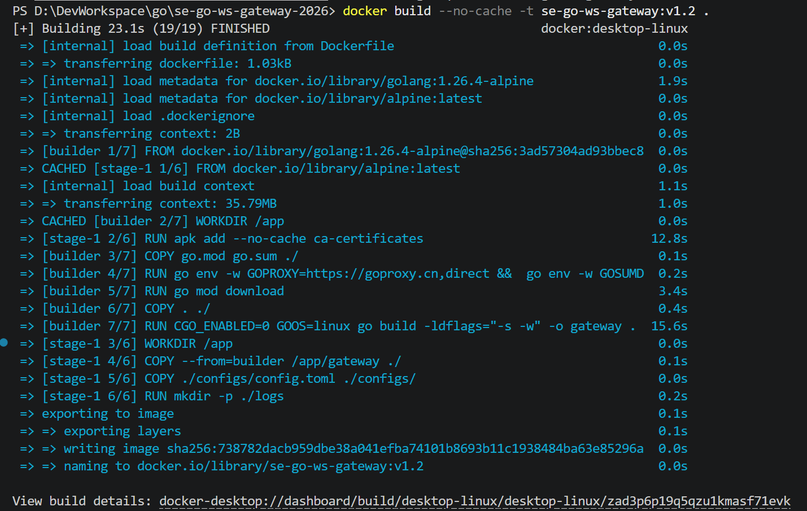

### B.2 容器运行状态截图（`docker-compose ps`）

> 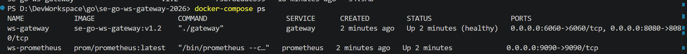

### B.3 健康检查截图（`curl /health`）

> 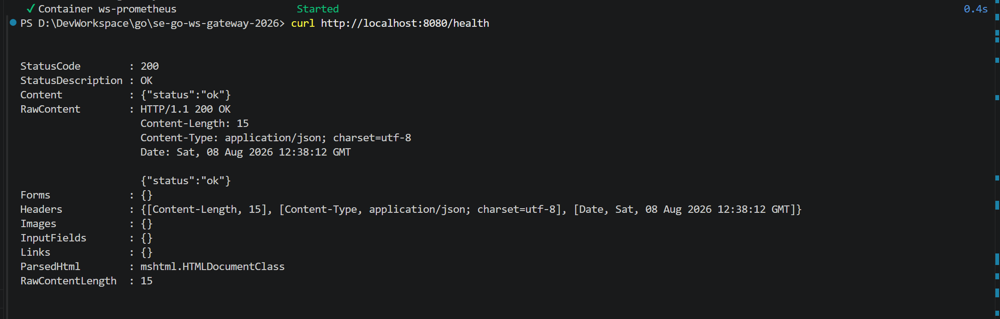

### B.4 WebSocket 连接成功截图（在线工具）

> 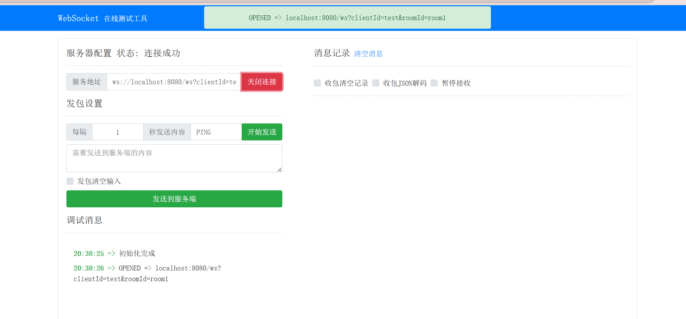

### B.5 广播截图（`git-bash`）

> 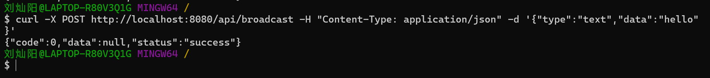

### B.6 Prometheus 指标查询截图

> 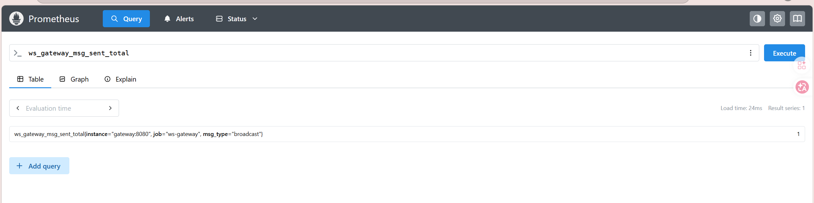
> 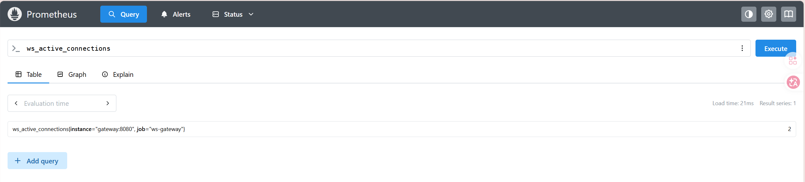

### B.7 pprof 火焰图截图

> 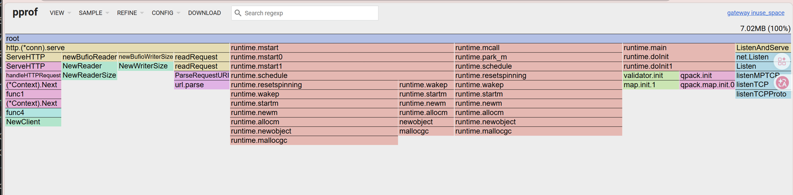
> 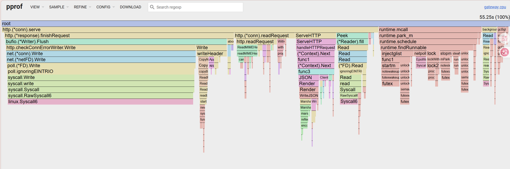
> 
> 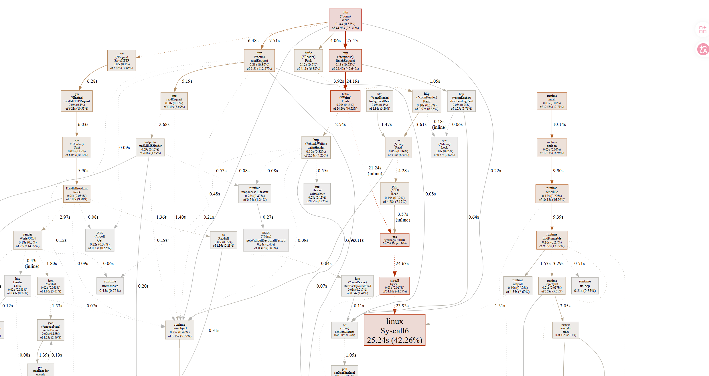

### B.8 docker 日志记录截图

> 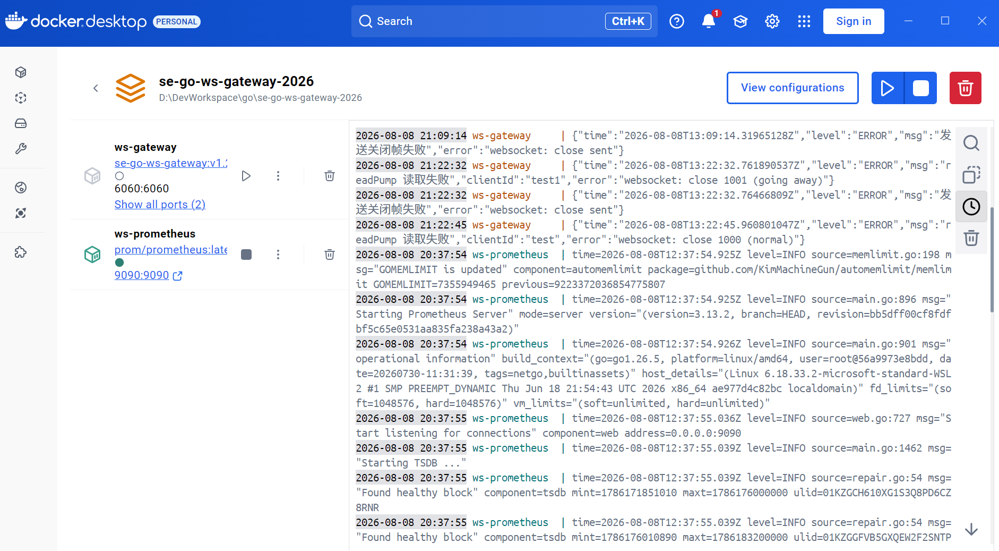

### B.9 回滚验证截图

> 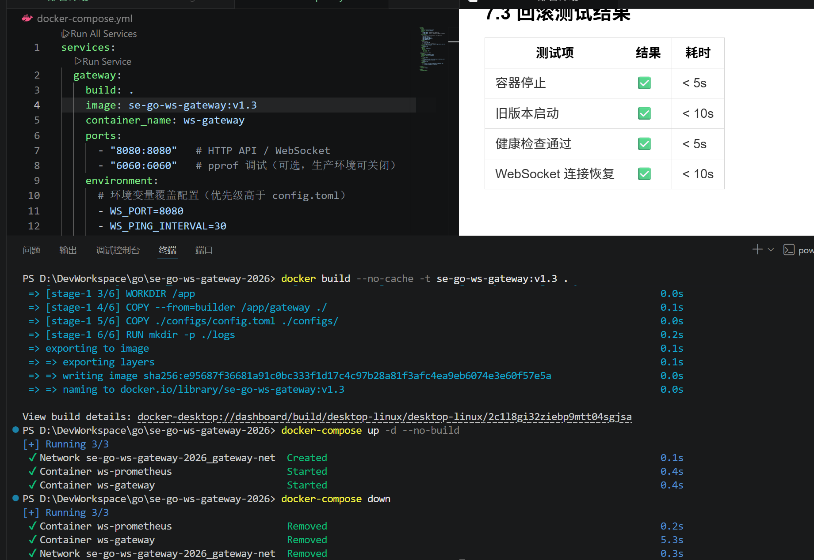
> 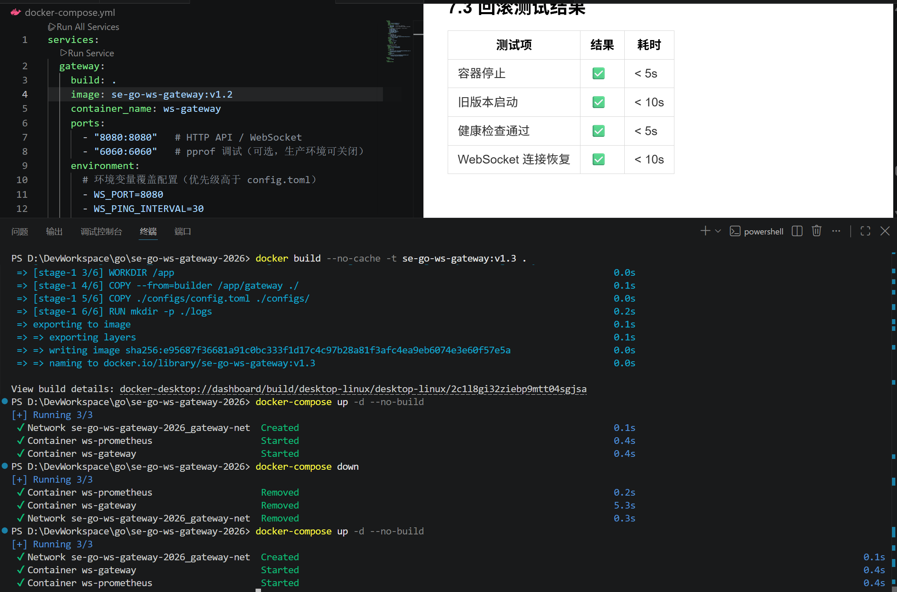
> 

---

**版本记录**

| 版本 | 日期 | 修改说明 |
| ---- | ---- | -------- |
| v1.0 | 2026-08-08 | 初始版本 |