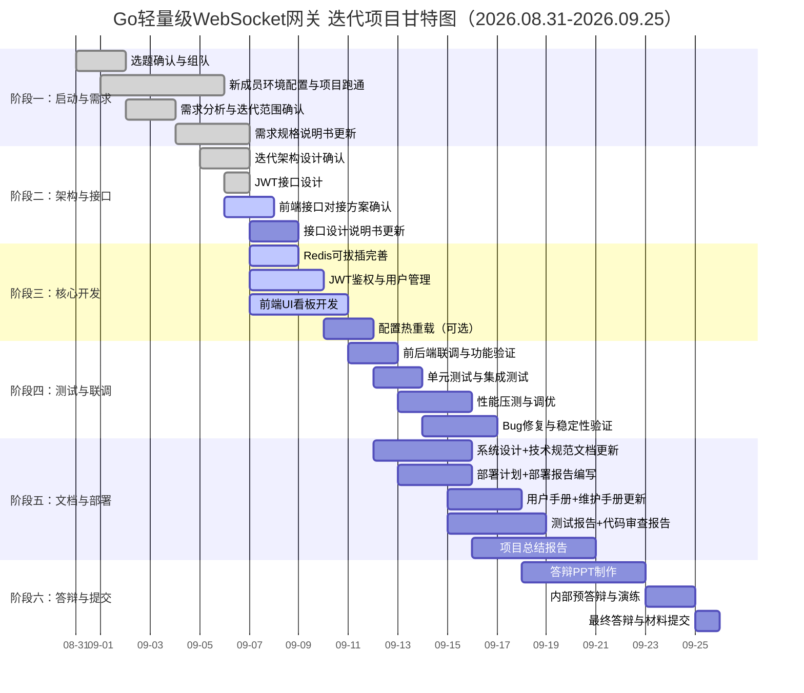

# **Go轻量级WebSocket网关 – 项目计划**

---

> **项目名称**：se-go-ws-gateway-2026
> 
> **版本**：v2.0
> 
> **日期**：2026-09-07
> 
> **编写人**: 刘灿阳   

---

[TOC]

---

## 一、项目成员表

| 姓名 | 角色 | 日期 | 开发软件版本号 |
|------|------|----------|----------------|
| 刘灿阳 | 项目负责人/后端开发 | 2026.09.01-09.25 | v2.0 |
| 罗培友 | 后端开发/测试 | 2026.09.01-09.25 | v2.0 |
| 占鹏辉 | 前端开发/后端开发 | 2026.09.01-09.25 | v2.0 |
| 谢昊翔 | 前端开发/后端协助 | 2026.09.01-09.25 | v2.0 |
| 彭炜程 | 前端开发/后端协助 | 2026.09.01-09.25 | v2.0 |
| 林海亮 | 运维/答辩 | 2026.09.01-09.25 | v2.0 |

---

## 二、项目背景与迭代说明

本项目基于2026年暑假完成的`se-go-ws-gateway-2026 v1.0`版本进行增量迭代开发。暑假版本已完成WebSocket接入、连接管理、消息路由（广播/房间/单播）、心跳保活、优雅启停、Prometheus监控、限流防护等核心功能，并通过了基础功能测试与初步压测。

本次迭代（v2.0）在保留原有架构与技术选型的基础上，新增以下核心功能：
1. **Redis Pub/Sub 可拔插扩展**：支持水平多实例部署下的消息同步，Redis不可用时自动降级为单机模式。
2. **JWT用户认证与鉴权**：统一保护WebSocket接入层与REST API管理层，采用bcrypt密码哈希+配置文件预置账号。
3. **前端管理UI看板**：提供登录页与仪表盘页面，支持可视化查看在线连接数、房间分布及广播消息操作。

本次迭代不涉及TLS/WSS支持、消息持久化与分布式强一致性机制。

---

## 三、项目时间表

| 阶段 | 任务描述 | 负责人员 | 开始日期 | 结束日期 |
|------|----------|----------|----------|----------|
| **阶段一** | **项目启动与需求确认** | | | |
| 1.1 | 选题确认、组队、背景调研 | 全体 | 2026-08-31 | 2026-09-01 |
| 1.2 | 新成员环境配置与项目跑通 | 谢昊翔、彭炜程、林海亮 | 2026-09-01 | 2026-09-05 |
| 1.3 | 需求分析与迭代范围确认 | 全体 | 2026-09-02 | 2026-09-03 |
| 1.4 | 编写/更新需求规格说明书（v2.0） | 刘灿阳 | 2026-09-04 | 2026-09-06 |
| **阶段二** | **架构设计与接口规划** | | | |
| 2.1 | 迭代架构设计与技术选型确认 | 刘灿阳 | 2026-09-05 | 2026-09-06 |
| 2.2 | JWT鉴权接口设计 | 刘灿阳 | 2026-09-06 | 2026-09-06 |
| 2.3 | 前端UI接口对接方案确认 | 占鹏辉、刘灿阳 | 2026-09-06 | 2026-09-07 |
| 2.4 | 更新接口设计说明书 | 占鹏辉 | 2026-09-07 | 2026-09-08 |
| **阶段三** | **核心功能开发** | | | |
| 3.1 | Redis可拔插完善（配置化+降级） | 罗培友 | 2026-09-07 | 2026-09-08 |
| 3.2 | JWT鉴权与用户管理实现 | 刘灿阳 | 2026-09-07 | 2026-09-09 |
| 3.3 | 前端UI看板开发（登录页+仪表盘） | 占鹏辉、谢昊翔、彭炜程 | 2026-09-07 | 2026-09-10 |
| 3.4 | 配置热重载（可选） | 刘灿阳 | 2026-09-10 | 2026-09-11 |
| **阶段四** | **集成联调与测试** | | | |
| 4.1 | 前后端联调与功能验证 | 全体 | 2026-09-11 | 2026-09-12 |
| 4.2 | 单元测试与集成测试 | 刘灿阳、罗培友 | 2026-09-12 | 2026-09-13 |
| 4.3 | 性能压测与调优 | 罗培友、刘灿阳 | 2026-09-13 | 2026-09-15 |
| 4.4 | Bug修复与稳定性验证 | 全体 | 2026-09-14 | 2026-09-16 |
| **阶段五** | **文档完善与部署** | | | |
| 5.1 | 更新系统设计文档与技术规范 | 全体 | 2026-09-12 | 2026-09-15 |
| 5.2 | 编写部署计划与部署报告 | 林海亮 | 2026-09-13 | 2026-09-15 |
| 5.3 | 更新用户手册与维护手册 | 林海亮 | 2026-09-15 | 2026-09-17 |
| 5.4 | 测试报告与代码审查报告 | 罗培友、占鹏辉 | 2026-09-15 | 2026-09-18 |
| 5.5 | 项目总结报告编写 | 全体 | 2026-09-16 | 2026-09-20 |
| **阶段六** | **验收与答辩** | | | |
| 6.1 | 答辩PPT制作 | 林海亮 | 2026-09-18 | 2026-09-22 |
| 6.2 | 内部预答辩与演练 | 全体 | 2026-09-23 | 2026-09-24 |
| 6.3 | 最终答辩与材料提交 | 全体 | 2026-09-25 | 2026-09-25 |

---

## 四、甘特图

---

## 五、资源分配

### 5.1 人员分配

| 成员 | 角色 | 主要职责 |
|------|------|----------|
| 刘灿阳 | 项目负责人/后端开发 | JWT鉴权与用户管理、配置热重载、核心模块集成、软件需求规格说明书、测试计划 |
| 罗培友 | 后端开发/测试 | Redis可拔插完善（配置化+降级）、压测脚本维护与执行、测试报告、开发进度报告 |
| 占鹏辉 | 前端开发/后端协助 | 前端UI看板设计与实现（组长）、HTTP 层与登录接口完善对接、接口设计说明书更新、代码审查报告 |
| 谢昊翔 | 前端开发 | 前端UI看板设计与实现（界面设计与样式）、协助后端开发、用户验收测试计划 |
| 彭炜程 | 前端开发 | 前端UI看板设计与实现（图表与数据展示）、协助后端开发、用户验收测试报告 |
| 林海亮 | 文档/运维 | 部署计划、部署报告、维护手册、用户手册更新、答辩PPT、答辩主讲 |

### 5.2 软硬件资源

| 资源类型 | 描述 | 数量/备注 |
|----------|------|-----------|
| 开发环境 | 个人电脑（Windows/macOS/Linux） | 6台 |
| 开发工具 | VS Code / GoLand / WebStorm | 开源/教育免费 |
| Go版本 | Go 1.26+ | 统一版本 |
| 前端技术 | HTML + CDN（Vue3或原生JS + ECharts） | 无需Node.js构建工具 |
| 依赖库 | gin, gorilla/websocket, prometheus/client_golang, golang/x/time/rate, go-redis/redis, jwt-go, bcrypt | go mod 管理 |
| 测试工具 | wscat, hey, Python 3.10+ | 开源免费 |
| 容器化 | Docker Desktop 24.0+ | 教育免费 |
| 版本控制 | Git + GitHub（公有仓库） | 免费 |
| 文档工具 | Markdown, Mermaid | 开源免费 |

---

## 六、项目预算

| 支出项 | 金额（元） | 说明 |
|--------|-----------|------|
| 云服务器资源 | 0 | 使用本地机器压测，无需云服务 |
| 开发工具 | 0 | 全部使用开源或教育免费版本 |
| Go依赖库 | 0 | 全部开源，go mod 管理 |
| 文档托管 | 0 | GitHub 公有仓库免费 |
| 容器镜像 | 0 | Docker Hub 免费 |
| **合计** | **0** | **无现金支出，仅为人力投入** |

---

## 七、项目风险管理表

| 风险编号 | 风险描述 | 可能性 | 影响 | 应对措施 | 负责人 |
|----------|----------|--------|------|----------|--------|
| R1 | 新成员对 Go 基础薄弱，前端能力较强 | 高 | 中 | 统一学习核心语法，分配前端任务 | 刘灿阳 |
| R2 | 前端技术方案选择不当导致部署复杂 | 中 | 中 | 强制采用 HTML+CDN 方式，禁止引入 Node.js 构建工具 | 占鹏辉 |
| R3 | JWT 中间件集成影响 WebSocket 握手性能 | 低 | 低 | 验签是纯 CPU 操作（<0.5ms），性能影响可忽略 | 刘灿阳 |
| R4 | 压测时间不足，性能数据不完整 | 中 | 中 | 提前准备压测脚本，优先确保核心场景数据 | 罗培友 |
| R5 | 团队成员时间协调困难 | 中 | 中 | 每日微信群同步进度，每周一次短会 | 刘灿阳 |
| R6 | 暑假版本性能指标（5000/50ms）在笔记本环境难以复现 | 中 | 低 | 在测试报告中说明环境局限性，采用分场景压测策略 | 刘灿阳 |

---

## 八、沟通计划

| 沟通对象 | 频率 | 方式 | 内容 |
|----------|------|------|------|
| 团队成员 | 每日 | 微信群消息 | 进度同步、问题反馈、任务确认 |
| 团队成员 | 每周 | 腾讯会议（15-20分钟） | 阶段总结、问题讨论、下周计划 |
| 指导老师 | 按需 | 微信/线下组会 | 阶段汇报、疑问解答、方向确认 |

---

## 九、关键交付节点

| 节点 | 日期 | 交付内容 |
|------|------|----------|
| 需求确认 | 2026-09-06 | 需求规格说明书（v2.0）定稿 |
| 核心开发完成 | 2026-09-10 | 三个核心功能（Redis/JWT/UI）代码完成 |
| 联调完成 | 2026-09-12 | 前后端联调通过，功能可演示 |
| 测试完成 | 2026-09-15 | 压测通过，测试报告初稿 |
| 文档完成 | 2026-09-20 | 全部文档交付 |
| 答辩 | 2026-09-25 | PPT + 现场演示 |

---

**版本记录**

| 版本 | 日期 | 修改说明 | 作者 |
|------|------|----------|------|
| v1.0 | 2026-07-04 | 初始版本（暑假实训） | 刘灿阳 |
| v1.1 | 2026-07-27 | 完善 Go 版本表述 | 刘灿阳 |
| v2.0 | 2026-09-07 | 综合实训迭代版本：更新成员为 6人，新增 Redis/JWT/UI 开发任务，调整时间线至 9 月 25 日答辩 | 刘灿阳 |