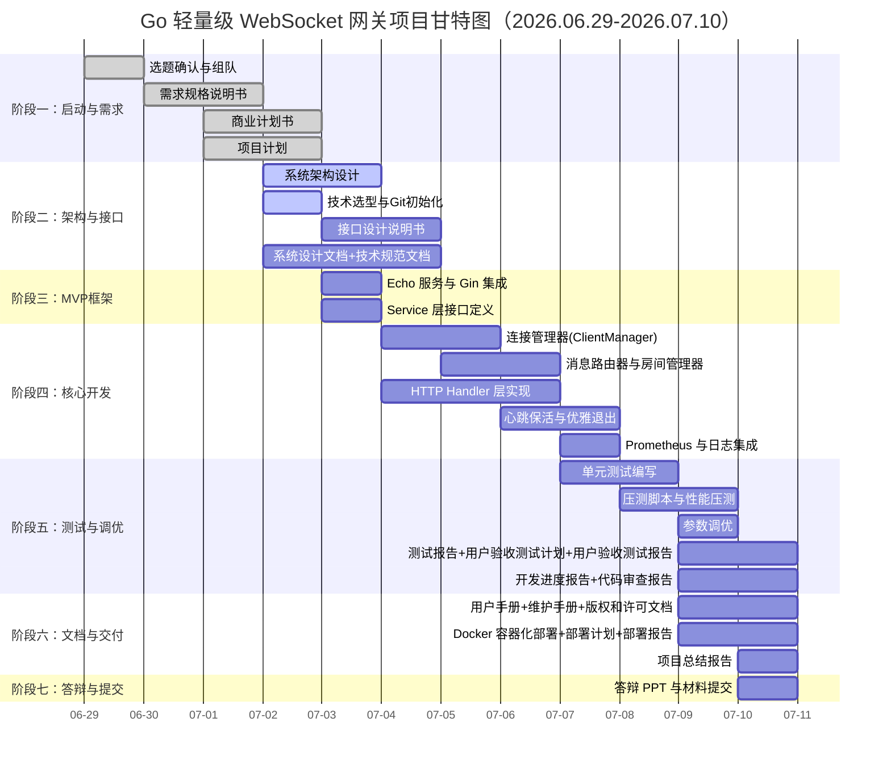

# **Go轻量级WebSocket网关 – 项目计划**

---

> **项目名称**：se-go-ws-gateway-2026
> 
> **版本**：v1.0
> 
> **日期**：2026-07-04
> 
> **编写人**: 刘灿阳   

---

[TOC]

---

## 一、项目成员表

| 姓名 | 角色 | 日期 | 开发软件版本号 |
|------|------|------|----------------|
| 刘灿阳 | 核心开发/测试 | 2026.06.29-07.10 | v1.0 |
| 罗培友 | 核心开发/测试/部署 | 2026.06.29-07.10 | v1.0 |
| 占鹏辉 | 后端开发/核心开发 | 2026.06.29-07.10 | v1.0 |

---

## 二、项目时间表

| 阶段 | 任务描述 | 负责人员 | 开始日期 | 结束日期 |
|------|----------|----------|----------|----------|
| **阶段一** | **项目启动与需求分析** | | | |
| 1.1 | 选题确认、组队、背景调研 | 全体 | 2026-06-29 | 2026-06-29 |
| 1.2 | 编写软件需求规格说明书 | 刘灿阳 | 2026-06-30 | 2026-07-01 |
| 1.3 | 编写商业计划书 | 罗培友 | 2026-07-01 | 2026-07-02 |
| 1.4 | 编写项目计划 | 刘灿阳 | 2026-07-01 | 2026-07-02 |
| **阶段二** | **系统架构与接口设计** | | | |
| 2.1 | 系统架构设计（分层设计） | 刘灿阳 | 2026-07-02 | 2026-07-03 |
| 2.2 | 技术选型与 Git 仓库初始化 | 全体 | 2026-07-02 | 2026-07-02 |
| 2.3 | 编写接口设计说明书 | 占鹏辉 | 2026-07-03 | 2026-07-04 |
| 2.4 | 编写系统设计文档与技术规范文档 | 全体 | 2026-07-02 | 2026-07-04 |
| **阶段三** | **MVP框架搭建** | | | |
| 3.1 | Gin 路由框架搭建与 Echo 服务实现 | 刘灿阳、占鹏辉 | 2026-07-03 | 2026-07-03 |
| 3.2 | Service 层接口定义 | 刘灿阳 | 2026-07-03 | 2026-07-03 |
| **阶段四** | **核心功能开发** | | | |
| 4.1 | 连接管理器（ClientManager）实现 | 刘灿阳 | 2026-07-04 | 2026-07-05 |
| 4.2 | 消息路由器与房间管理器实现 | 刘灿阳、罗培友 | 2026-07-05 | 2026-07-06 |
| 4.3 | HTTP Handler层实现（4个 REST 端点） | 占鹏辉 | 2026-07-04 | 2026-07-06 |
| 4.4 | 心跳保活（Ping/Pong）与优雅退出 | 刘灿阳 | 2026-07-06 | 2026-07-07 |
| 4.5 | Prometheus 指标与结构化日志集成 | 罗培友、刘灿阳 | 2026-07-07 | 2026-07-07 |
| **阶段五** | **测试与调优** | | | |
| 5.1 | 单元测试编写 | 全体 | 2026-07-07 | 2026-07-08 |
| 5.2 | 压测脚本编写与性能压测执行 | 罗培友、刘灿阳 | 2026-07-08 | 2026-07-09 |
| 5.3 | 参数调优 | 全体 | 2026-07-09 | 2026-07-09 |
| 5.4 | 测试报告/用户验收测试计划/用户验收测试报告 | 罗培友 | 2026-07-09 | 2026-07-10 |
| 5.5 | 开发进度报告/代码审查报告 | 占鹏辉 | 2026-07-09 | 2026-07-10 |
| **阶段六** | **文档整合与交付** | | | |
| 6.1 | 用户手册/维护手册/版权和许可文档 | 占鹏辉 | 2026-07-09 | 2026-07-10 |
| 6.2 | Docker 容器化部署/部署计划/部署报告 | 罗培友 | 2026-07-09 | 2026-07-10 |
| 6.3 | 项目总结报告 | 全体 | 2026-07-10 | 2026-07-10 |
| **阶段七** | **答辩与提交** | | | |
| 7.1 | 答辩 PPT 制作 | 刘灿阳 | 2026-07-10 | 2026-07-10 |
| 7.2 | 所有材料打包提交 | 全体 | 2026-07-10 | 2026-07-10 |

---

## 三、甘特图

---

## 四、资源分配

### 4.1 人员分配

| 成员 | 角色 | 主要职责 |
|------|------|----------|
| 刘灿阳 | 核心开发/测试 | 软件需求规格说明书、连接管理、消息路由、心跳、性能调优、项目总结报告 |
| 罗培友 | 核心开发/测试/部署 | 房间管理、优雅退出、压测脚本、测试报告、Docker 容器化部署 |
| 占鹏辉 | 后端开发/核心开发 | 接口设计说明书、HTTP Handler 层、消息路由、开发进度报告、代码审查报告 |

### 4.2 软硬件资源

| 资源类型 | 描述 | 数量/备注 |
|----------|------|-----------|
| 开发环境 | 个人电脑（Windows/Linux） | 3台 |
| 开发工具 | VS Code / GoLand | 开源/教育免费 |
| Go版本 | Go 1.25+ | 统一版本 |
| 依赖库 | gin, gorilla/websocket, prometheus/client_golang | go mod 管理 |
| 测试工具 | wscat, hey, Python 3.10+ | 开源免费 |
| 容器化 | Docker Desktop 24.0+ | 教育免费 |
| 版本控制 | Git + GitHub | 免费私有仓库 |
| 文档工具 | Markdown, Mermaid | 开源免费 |

---

## 五、项目预算

| 支出项 | 金额（元） | 说明 |
|--------|-----------|------|
| 云服务器资源 | 0（可选） | 可使用本地机器或学校云资源 |
| 开发工具 | 0 | 全部使用开源或教育免费版本 |
| Go依赖库 | 0 | 全部开源，go mod 管理 |
| 文档托管 | 0 | GitHub 免费仓库 |
| 容器镜像 | 0 | Docker Hub 免费 |
| **合计** | **0** | **无现金支出，仅为人力投入** |

---

## 六、项目风险管理表

| 风险编号 | 风险描述 | 可能性 | 影响 | 应对措施 | 负责人 |
|----------|----------|--------|------|----------|--------|
| R1 | 团队成员对 Go 掌握程度不一，影响编码效率 | 中 | 中 | 统一学习核心语法，复杂模块由熟练成员负责 | 刘灿阳 |
| R2 | 并发模型设计不当导致死锁或性能瓶颈 | 中 | 高 | 先画并发流程图，使用`go test -race`检测 | 刘灿阳 |
| R3 | 压测时间不足，未收集有效性能数据 | 中 | 中 | 提前准备压测脚本，可降低目标连接数 | 罗培友 |
| R4 | 文档编写量大，后期时间紧张 | 高 | 高 | 文档与开发同步推进，每人分担部分 | 全体 |

---

## 七、沟通计划

| 沟通对象 | 频率 | 方式 | 内容 |
|----------|------|------|------|
| 团队成员 | 每日 | 微信/腾讯会议（15分钟站会） | 进展同步、问题讨论、任务确认 |
| 团队成员 | 代码提交时 | GitHub PR + Code Review | 代码质量检查、功能验证 |
| 指导老师 | 按需 | 微信/邮件 | 阶段汇报、疑问解答、方向确认 |

---

**版本记录**

| 版本 | 日期 | 修改说明 | 作者 |
|------|------|----------|------|
| v1.0 | 2026-07-04 | 初始版本 | 刘灿阳 |