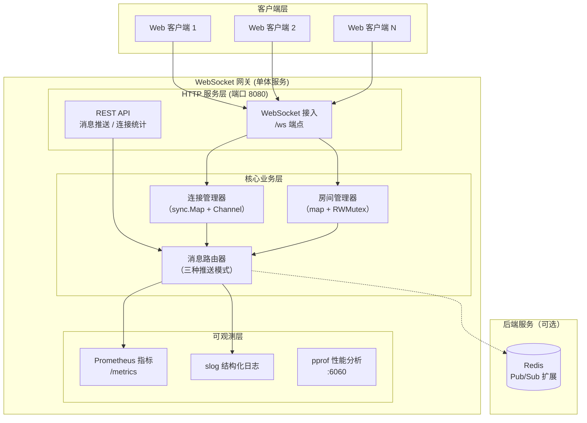
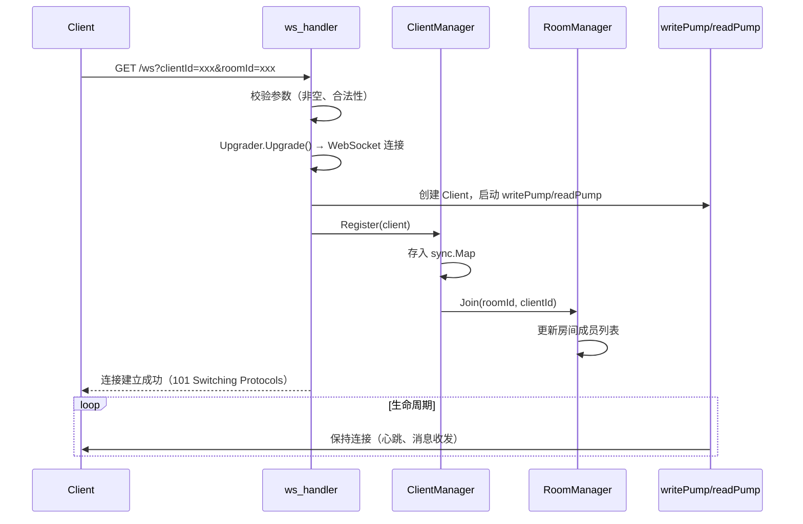
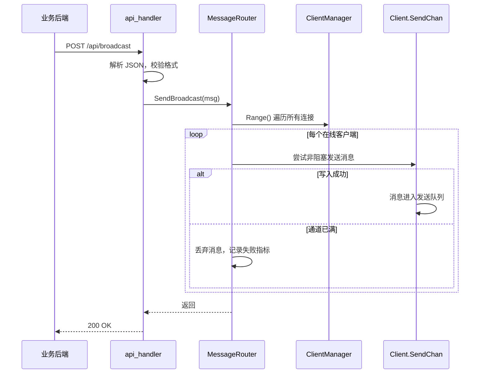
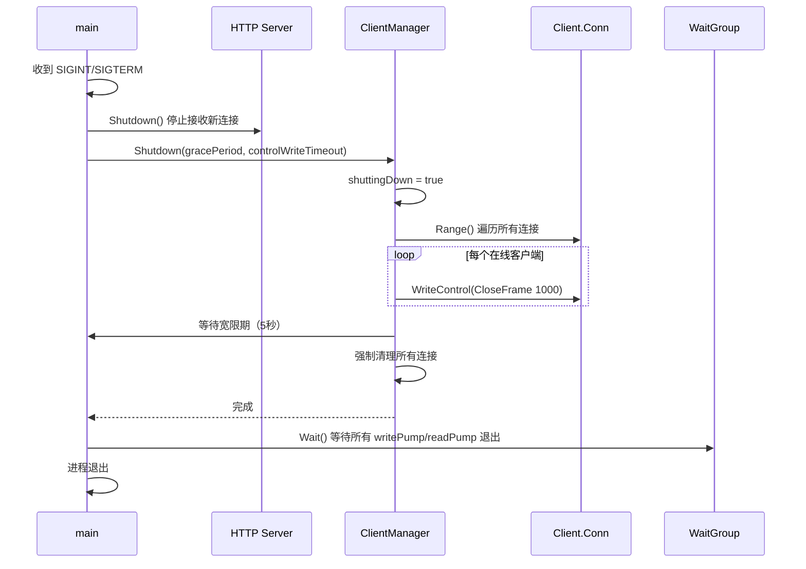

# **Go轻量级WebSocket网关 – 系统设计文档**

---

> **项目名称**：se-go-ws-gateway-2026
> 
> **版本**：v1.1
> 
> **日期**：2026-08-09
> 
> **编写人**：项目组

---

[TOC]

---

## 一、系统架构

### 1.1 总体架构图



### 1.2 核心组件说明

| 组件 | 技术选型 | 职责 |
|------|---------|------|
| HTTP 服务 | Gin | 路由注册、请求解析、响应输出；WebSocket 升级端点与 REST 管理接口共用同一端口 |
| WebSocket 接入层 | gorilla/websocket | 负责 HTTP 到 WebSocket 的协议升级，以及帧的读写操作；Upgrader 支持从配置文件读取缓冲区大小 |
| 连接管理器 | sync.Map + Channel | 存储所有在线客户端（`clientId` → `Client`），通过 CSP 模型处理注册/注销事件，支持并发安全读写 |
| 房间管理器 | map + RWMutex | 维护房间与客户端 ID 列表的映射关系，支持安全增删查 |
| 消息路由器 | 纯 Go 逻辑 | 实现全服广播、房间广播、单播三种分发策略，采用非阻塞 `select` 发送 |
| 监控指标 | prometheus/client_golang | 暴露连接数、消息计数等指标，供 Prometheus 采集 |
| 日志 | log/slog | 输出结构化 JSON 日志，记录关键事件与性能数据 |
| 限流 | golang.org/x/time/rate | 基于 IP 的令牌桶限流，挂载到 `/api` 路由组 |
| 性能分析 | net/http/pprof | 提供 CPU 和内存 Profile 采集能力，调试端口 6060 |

### 1.3 技术选型对比

| 决策 | 理由 | 替代方案 |
|------|------|----------|
| 使用 Gin 作为 HTTP 框架 | 轻量、高性能、中间件丰富，团队成员熟悉度高 | 标准库 net/http（开发效率略低） / gorilla/mux（团队不熟悉） |
| 使用 gorilla/websocket | WebSocket 实现成熟稳定，社区广泛使用 | nhooyr.io/websocket（较新，生态略小） |
| 使用 sync.Map 存储连接 | 官方并发安全容器，读写分离设计，适合连接池读多写少场景 | 手写 map + RWMutex（更灵活但需自行保证并发安全） |
| 连接模型为 per-goroutine | 充分利用 Go 的并发优势，每个连接独立 Goroutine，隔离性好 | 协程池（连接数增大时可通过池复用控制资源） |
| 使用 channel 进行消息通信 | 符合 Go 的并发哲学，天然支持阻塞/非阻塞发送 | 共享内存 + 锁（易产生竞态，代码复杂度高） |
| 不引入外部数据库 | 网关核心为连接管理，无持久化需求，内存存储足以满足性能目标 | Redis（作为可选扩展，已预留接口） |
| 环境变量覆盖配置 | 容器化部署时无需修改配置文件，便于运维 | 仅配置文件（灵活性不足） |

---

## 二、模块详细设计

### 2.1 目录结构

```
se-go-ws-gateway-2026/
├── cmd/
│   ├── gateway/
│   │   └── main.go                 # 程序入口，依赖组装，优雅退出
│   └── loadtest/
│       └── main.go                 # 压测工具（自定义 WebSocket 负载测试）
├── internal/
│   ├── config/
│   │   └── config.go               # 配置加载与校验（TOML + 环境变量）
│   ├── handler/
│   │   ├── api_handler.go          # REST API 路由处理（广播/房间/单播/stats）
│   │   └── ws_handler.go           # WebSocket 升级与连接管理（含 upgrader 配置化）
│   ├── service/
│   │   ├── client_manager.go       # 连接池管理（注册/注销/查找，CSP 模型）
│   │   ├── client_manager_test.go  # 连接管理器单元测试
│   │   ├── message_router.go       # 消息路由（广播/房间广播/单播，含 Redis 扩展）
│   │   ├── message_router_test.go  # 消息路由器单元测试
│   │   ├── room_manager.go         # 房间成员管理（增删查）
│   │   ├── room_manager_test.go    # 房间管理器单元测试
│   │   └── helpers_test.go         # 测试辅助函数
│   ├── model/
│   │   ├── client.go               # Client 结构体
│   │   ├── constants.go            # WebSocket 关闭码与业务响应码常量
│   │   └── message.go              # Message 结构体
│   └── middleware/
│       └── rate_limit.go            # 限流中间件（令牌桶）
│       └── rate_limit_test.go
├── pkg/
│   ├── limiter/                    # 令牌桶限流器（IP 隔离）
│   │   ├── limiter.go
│   │   └── limiter_test.go
│   ├── logger/                     # slog 日志初始化
│   │   ├── logger.go
│   │   └── logger_test.go
│   └── metrics/                    # Prometheus 指标注册
│       └── metrics.go
├── configs/
│   └── config.toml                 # 配置文件
├── docs/                           # 项目文档
├── logs/                           # 日志文件目录
├── test_results/                   # 压测结果输出
├── docker-compose.yml              # 容器编排（网关 + Prometheus）
├── Dockerfile                      # 多阶段构建镜像
├── prometheus.yml                  # Prometheus 采集配置
├── .gitignore
├── go.mod
├── go.sum
├── README.md
└── LICENSE
```

### 2.2 数据模型 (`internal/model`)

**Client 结构体**：

```go
type Client struct {
    ClientID string          // 客户端唯一标识
    RoomID   string          // 所属房间 ID
    Conn     *websocket.Conn // WebSocket 连接对象
    SendChan chan []byte     // 消息发送通道（缓冲区大小可配置）
    LastPong time.Time       // 最后一次收到 Pong 的时间
    mu       sync.Mutex      // 保护 Conn 的写操作
}
```

**Message 结构体**：

```go
type Message struct {
    Payload []byte // 原始消息二进制内容
}
```

网关不关心业务层消息格式，所有消息作为二进制 Payload 透传，由业务方自行定义 JSON 或其他格式。

**常量定义**（`constants.go`）：

```go
// WebSocket 自定义关闭码（4000-4999 为应用自定义范围）
const (
    CloseCodeMissingParam  = 4000 // 参数缺失
    CloseCodeInvalidFormat = 4001 // 参数格式无效
    CloseCodeDuplicateID   = 4002 // clientId 已存在
)

// 业务响应码（独立于 HTTP 状态码）
const (
    BizCodeSuccess       = 0   // 业务成功
    BizCodeBadRequest    = 400 // 请求参数错误
    BizCodeNotFound      = 404 // 资源不存在
    BizCodeInternalError = 500 // 服务器内部错误
)
```

**统计信息响应**：

```json
{
  "code": 0,
  "status": "success",
  "data": {
    "online_connections": 5000,
    "all_rooms_connections_stats": {
      "room1": 1000,
      "room2": 2000
    },
    "gateway_server_initial_time": 3600
  }
}
```

### 2.3 连接管理器 (`internal/service/client_manager.go`)

**功能职责**：
- 提供连接注册、注销、按 ID 查找、遍历所有连接的能力
- 内部使用 `sync.Map` 保证并发安全
- 通过 `register` 和 `unregister` channel 接收事件，解耦业务逻辑与底层存储
- 支持优雅退出时的同步清理

**关键数据结构**：

```go
type ClientManager struct {
    clients      sync.Map           // clientId -> *model.Client
    register     chan *model.Client // 注册通道
    unregister   chan string        // 注销通道
    roomMgr      *RoomManager
    shuttingDown bool               // 优雅退出标志
}
```

**关键方法**：

| 方法 | 功能 | 调用方 |
|------|------|--------|
| `Register(client *Client)` | 向 register 通道发送注册事件 | ws_handler |
| `Unregister(clientID string)` | 向 unregister 通道发送注销事件 | ws_handler / 心跳超时 |
| `Get(clientID string) (*Client, bool)` | 根据 ID 查找客户端 | message_router |
| `Range(fn func(key, val any) bool)` | 遍历所有在线客户端（供广播使用） | message_router |
| `GetOnlineCount() int` | 获取当前在线连接数 | api_handler |
| `Init(ctx, controlWriteTimeout)` | 主循环，处理 register/unregister 事件 | main.go |
| `Shutdown(gracePeriod, controlWriteTimeout)` | 优雅退出，同步关闭所有连接 | main.go |

### 2.4 房间管理器 (`internal/service/room_manager.go`)

**功能职责**：
- 维护房间（`roomId`）与客户端 ID 列表的映射关系
- 支持向指定房间获取所有客户端 ID
- 使用 `RWMutex` 保证并发安全
- 房间无人时自动删除

**数据结构**：

```go
type RoomManager struct {
    rooms map[string]map[string]bool  // roomId -> set of clientId
    mu    sync.RWMutex
}
```

**关键方法**：

| 方法 | 功能 |
|------|------|
| `Join(roomID, clientID string)` | 将客户端加入房间（幂等） |
| `Leave(roomID, clientID string)` | 将客户端移出房间 |
| `GetClients(roomID string) []string` | 获取房间内所有客户端 ID 列表 |
| `RemoveClientFromAllRooms(clientID string)` | 从所有房间中移除该客户端 |
| `GetAllRoomsConnStats() map[string]int` | 获取所有房间的连接统计 |
| `HasRoom(roomID string) bool` | 检查房间是否存在 |

### 2.5 消息路由器 (`internal/service/message_router.go`)

**功能职责**：
- 实现三种消息分发模式：全服广播、房间广播、单播
- 所有发送采用 **非阻塞 select** 策略，避免单个慢客户端阻塞整个广播
- 支持 Redis Pub/Sub 扩展（多实例部署时同步消息）
- 更新 Prometheus 指标（消息发送成功/失败计数）

**三种分发逻辑**：

| 模式 | 调用方式 | 实现 |
|------|----------|------|
| 全服广播 | `SendBroadcast(msg *Message)` | 遍历连接池，向每个 `Client.SendChan` 通道尝试发送，若通道满则丢弃并记录失败指标 |
| 房间广播 | `SendRoom(roomId string, msg *Message)` | 获取房间成员列表，逐个调用 `SendSingle` 发送 |
| 单播 | `SendSingle(clientId string, msg *Message) bool` | 直接通过 ID 查找连接，向 `SendChan` 发送，失败返回 false |

**关于非阻塞发送**：每个发送操作使用 `select` 语句，包含 `default` 分支，当通道满时立即返回，不阻塞其他连接的处理流程。此策略确保广播操作的 O(n) 时间复杂度不受单点阻塞影响。

**Redis 扩展**：
- 当 `redisCli != nil` 时，消息路由器自动启动 `subscribeRedis` 协程
- 监听 `ws:broadcast` 和 `ws:room:*` 频道
- 收到跨实例消息后转发到本地连接池

### 2.6 Handler 层 (`internal/handler`)

**2.6.1 WebSocket Handler (`ws_handler.go`)**

负责 `/ws` 端点的请求处理：

1. **Upgrader 配置化**：在函数内部根据配置动态创建 `websocket.Upgrader`：
   ```go
   upgrader := websocket.Upgrader{
       CheckOrigin:     func(r *http.Request) bool { return true },
       ReadBufferSize:  cfg.Websocket.ReadBufferSize,
       WriteBufferSize: cfg.Websocket.WriteBufferSize,
   }
   ```

2. **优雅退出检查**：若 `clientMgr.IsShuttingDown()` 为 true，返回关闭帧（状态码 1001）拒绝新连接。

3. **参数校验**：解析 `clientId` 和 `roomId`，校验非空且符合正则 `^[a-zA-Z0-9_-]+$`。

4. **重复连接检查**：通过 `clientMgr.Get` 检查 `clientId` 是否已被占用。

5. **连接注册**：创建 `Client` 结构体，调用 `clientMgr.Register`。

6. **Pong 处理器**：通过 `SetPongHandler` 记录 `LastPong` 时间并延长读超时。

7. **启动读写协程**：`writePump`（从 SendChan 读取并写入 WebSocket + 定时发送 Ping）和 `readPump`（读取 WebSocket 消息 + 检测 Pong 超时）。

**关闭状态码**：

| 状态码 | 含义 |
|--------|------|
| `1000` | 正常关闭 |
| `1001` | 服务正在关闭 |
| `4000` | `clientId` 或 `roomId` 缺失 |
| `4001` | 参数格式无效（含特殊字符） |
| `4002` | `clientId` 已存在 |

**2.6.2 REST API Handler (`api_handler.go`)**

负责四个管理端点的实现：

| 端点 | 方法 | 功能 | 请求体/参数 |
|------|------|------|-------------|
| `/api/broadcast` | POST | 全服广播 | JSON 对象或数组 |
| `/api/room/:roomId/broadcast` | POST | 房间广播 | JSON 对象或数组 |
| `/api/client/:clientId/send` | POST | 单播 | JSON 对象或数组 |
| `/api/stats` | GET | 获取统计信息 | 无 |

**响应统一格式**：

```json
{
  "code": 0,
  "status": "success",
  "data": null
}
```

### 2.7 限流中间件 (`internal/middleware/ratelimit.go`)

基于 IP 地址的令牌桶限流，挂载到 `/api` 路由组：

```go
func HandleRateLimit(lm limiter.Limiter) gin.HandlerFunc {
    return func(ctx *gin.Context) {
        ip := ctx.ClientIP()
        if lm.Allow(ip) {
            ctx.JSON(http.StatusTooManyRequests, gin.H{"error": "too many requests"})
            ctx.Abort()
            return
        }
        ctx.Next()
    }
}
```

### 2.8 心跳保活机制

**设计原则**：
- 服务端主动发起 Ping 帧，客户端响应 Pong 帧
- 采用 WebSocket 协议内置的控制帧（Ping/Pong），而非业务层心跳消息
- 所有超时参数可配置（通过 `config.toml`）

**实现方式**：
- 每个客户端连接在启动后，由 `readPump` 通过 `SetPongHandler` 注册 Pong 回调，记录 `LastPong` 时间
- 在 `writePump` 中启动一个定时器（默认 30 秒间隔），通过 `conn.WriteControl` 发送 Ping 帧
- 若在超时时间（默认 60 秒）内未收到 Pong，`readPump` 检测到超时后主动关闭连接并触发 `Unregister`

### 2.9 优雅退出

**设计原则**：
- 保证服务关闭时现有连接能够正常完成数据发送
- 避免资源泄漏（Goroutine、文件描述符等）
- 使用 `context` + `sync.WaitGroup` + `shuttingDown` 标志实现

**流程**：
1. 监听 `SIGINT` 和 `SIGTERM` 系统信号
2. 收到信号后：
   - `cancel()` 通知所有协程退出
   - `http.Server.Shutdown(ctx)` 关闭 HTTP Server，停止接收新请求
   - `clientMgr.Shutdown(cfg.ShutdownTimeout(), cfg.ControlWriteTimeout())`
3. `ClientManager.Shutdown` 执行：
   - 设置 `shuttingDown = true`（拒绝新连接）
   - 遍历所有连接，发送 WebSocket Close 控制帧（状态码 1000）
   - 等待宽限期（默认 5 秒）
   - 强制清理所有连接（关闭通道、移除房间、关闭连接）
4. `wg.Wait()` 等待所有 `writePump` / `readPump` Goroutine 退出
5. 主进程退出

### 2.10 监控与可观测性

**Prometheus 指标**：

| 指标名 | 类型 | 标签 | 说明 |
|--------|------|------|------|
| `ws_active_connections` | Gauge | 无 | 当前在线连接总数 |
| `ws_connection_events_total` | Counter | 无 | 连接建立/关闭事件计数 |
| `ws_gateway_msg_sent_total` | Counter | `msg_type`（single/room/broadcast） | 累计发送消息数（按类型） |
| `ws_gateway_msg_send_fail_total` | Counter | `reason`（single_offline/single_block/broadcast_block） | 消息发送失败数 |
| `ws_messages_received_total` | Counter | 无 | 累计接收消息数 |

**pprof 性能分析**：
- 通过 `_ "net/http/pprof"` 导入，自动注册路由
- 独立端口 6060：`http.ListenAndServe(":6060", nil)`
- 采集命令：
  ```bash
  go tool pprof -http=:8081 http://localhost:6060/debug/pprof/profile?seconds=30
  go tool pprof -http=:8081 http://localhost:6060/debug/pprof/heap
  ```

**日志**：
- 使用 `log/slog` 标准库，输出 JSON 格式
- 记录连接建立、关闭、心跳超时、消息发送失败等关键事件
- 包含 `clientId`、`roomId`、`error` 等结构化字段

---

## 三、接口设计

### 3.1 外部接口

**WebSocket 接入**：

| 端点 | 协议 | 参数 | 说明 |
|------|------|------|------|
| `/ws` | WebSocket | `clientId`, `roomId` | 建立 WebSocket 长连接 |

**REST API**：

| 方法 | 端点 | 说明 |
|------|------|------|
| POST | `/api/broadcast` | 全服广播 |
| POST | `/api/room/:roomId/broadcast` | 房间广播 |
| POST | `/api/client/:clientId/send` | 单播 |
| GET | `/api/stats` | 获取统计信息 |
| GET | `/metrics` | Prometheus 指标端点 |
| GET | `/health` | 健康检查 |

### 3.2 内部接口

| 接口 | 定义 | 职责 | 调用方 |
|------|------|------|--------|
| `ClientManager.Register` | `func Register(c *Client)` | 注册连接 | `ws_handler` |
| `ClientManager.Unregister` | `func Unregister(id string)` | 注销连接 | `ws_handler` / 心跳超时 |
| `ClientManager.Get` | `func Get(id string) (*Client, bool)` | 查找连接 | `message_router` |
| `ClientManager.Range` | `func Range(fn func(key, value any) bool)` | 遍历连接池 | `message_router.SendBroadcast` |
| `ClientManager.GetOnlineCount` | `func GetOnlineCount() int` | 获取在线数 | `api_handler` |
| `ClientManager.Init` | `func Init(ctx, controlWriteTimeout)` | 主循环 | `main.go` |
| `ClientManager.Shutdown` | `func Shutdown(gracePeriod, controlWriteTimeout)` | 优雅退出 | `main.go` |
| `RoomManager.Join` | `func Join(roomID, clientID string)` | 加入房间 | `ClientManager.Init` |
| `RoomManager.Leave` | `func Leave(roomID, clientID string)` | 离开房间 | `ClientManager.Unregister` |
| `RoomManager.GetClients` | `func GetClients(roomID string) []string` | 获取房间成员 | `message_router.SendRoom` |
| `RoomManager.RemoveClientFromAllRooms` | `func RemoveClientFromAllRooms(clientID string)` | 从所有房间移除 | `ClientManager.Unregister` |
| `MessageRouter.SendSingle` | `func SendSingle(clientId string, msg *Message) bool` | 单播 | `api_handler` |
| `MessageRouter.SendRoom` | `func SendRoom(roomId string, msg *Message)` | 房间广播 | `api_handler` |
| `MessageRouter.SendBroadcast` | `func SendBroadcast(msg *Message)` | 全服广播 | `api_handler` |

---

## 四、数据流设计

### 4.1 连接建立时序图



### 4.2 广播消息时序图



### 4.3 优雅退出时序图



---

## 五、安全设计

| 安全层面 | 措施 | 说明 |
|----------|------|------|
| 参数校验 | WebSocket 升级时检查 `clientId` 和 `roomId` 非空、正则 `^[a-zA-Z0-9_-]+$` | 防止注入式攻击和特殊字符注入 |
| 限流 | 对 REST API 端点应用令牌桶限流中间件（默认 12 秒 5 个令牌） | 防止恶意高频调用压垮网关 |
| 请求校验 | 对 REST API 请求体进行 JSON 格式校验（`json.Valid`） | 拒绝格式错误的请求 |
| 连接安全 | 支持通过环境变量启用 WSS（TLS） | 证书由外部提供，增强传输层安全 |
| 错误处理 | Gin 的 `Recovery` 中间件捕获 panic，防止单点崩溃影响全局 | 保证服务稳定性 |
| 并发安全 | 所有共享数据结构使用 `sync.Map` 或 `RWMutex` 保护 | 防止数据竞态 |
| 优雅退出 | 关闭期间通过 `shuttingDown` 标志拒绝新连接 | 避免关闭期间新连接干扰 |

---

## 六、性能优化

| 优化策略 | 说明 |
|----------|------|
| 非阻塞发送 | 使用 `select + default` 方式向 `Client.SendChan` 通道发送消息，避免单个慢客户端阻塞整个广播链路 |
| sync.Map 读多写少优化 | 连接池读操作远多于写操作，使用 `sync.Map` 可充分利用其读写分离特性 |
| 通道缓冲区可配置 | `SendChan`、`register`、`unregister` 通道缓冲区大小可通过配置文件调整 |
| 心跳间隔可调 | 心跳间隔和超时时间可配置，便于在不同网络环境下调整保活策略 |
| Goroutine 轻量 | 每个连接仅占用 2 个 Goroutine（writePump + readPump），充分利用 Go 的轻量级并发优势 |
| Gin 生产模式 | 设置 `gin.SetMode(gin.ReleaseMode)` 减少框架内部日志开销 |
| 日志级别控制 | 生产环境设置为 `error` 级别，避免日志 I/O 成为性能瓶颈 |
| 健康检查 | 提供 `/health` 端点，便于负载均衡器检测服务状态，配合容器编排自动摘除异常实例 |

---

## 七、扩展性与维护性

| 维度 | 设计 |
|------|------|
| 分层架构 | Handler / Service 分层清晰，HTTP 处理与核心业务逻辑解耦，便于独立修改和测试 |
| 配置化 | 所有关键参数（心跳间隔、超时时间、通道缓冲区大小、端口等）均通过 `config.toml` 管理，支持环境变量覆盖 |
| Redis 可拔插 | Redis Pub/Sub 扩展作为可选功能，通过传入 `redisCli` 参数激活，不影响核心单机模式 |
| 单元测试 | 核心模块（ClientManager、RoomManager、MessageRouter）均有独立单元测试，覆盖率 82.9% |
| 容器化部署 | 提供 Dockerfile（多阶段构建，34.9MB）和 docker-compose.yml，支持一键启动网关 + Prometheus |
| 压测工具 | 提供自定义 `loadtest` 工具，支持连接建立测试、广播延迟测试、混合负载测试、长时间稳定性测试 |
| 性能分析 | 集成 pprof，支持 CPU 和内存 Profile 采集，便于生产环境性能问题定位 |

---

## 八、部署架构

| 环境 | 配置 | 说明 |
|------|------|------|
| 开发环境 | 本地 `go run` | 使用 `configs/config.toml` 配置，服务监听 `localhost:8080` |
| 测试/压测环境 | Docker Compose | 一键启动网关服务 + Prometheus，便于压测和功能验证 |
| 生产环境 | 容器化部署 | 镜像 34.9MB（Alpine 基础镜像），支持 Kubernetes 等容器编排平台 |

**Docker Compose 服务组成**：
- `gateway`：WebSocket 网关服务（主服务），暴露 8080（业务）和 6060（pprof）
- `prometheus`：监控指标采集，暴露 9090

---

## 九、附录

### 9.1 术语表

| 术语 | 说明 |
|------|------|
| WebSocket | 全双工通信协议，基于 TCP，支持长连接 |
| 网关 | 作为客户端与业务后端之间的中间层，负责连接管理与消息路由 |
| 长连接 | 指 WebSocket 连接保持不断开，可持续进行双向通信 |
| 广播 | 将消息推送给所有在线客户端 |
| 房间广播 | 将消息推送给同一房间内的所有客户端 |
| 单播 | 将消息推送给指定的单个客户端 |
| 心跳保活 | 通过周期性 Ping/Pong 帧检测连接是否存活，及时清理无效连接 |
| 优雅退出 | 服务关闭时，先发送关闭帧告知客户端，等待数据发送完成再退出，确保不丢失消息 |
| 非阻塞发送 | 使用 `select` 语句的 `default` 分支尝试发送，若通道满则跳过，避免阻塞主流程 |

### 9.2 设计决策记录

| 决策 | 理由 | 替代方案 |
|------|------|----------|
| 使用 Gorilla/WebSocket | 成熟稳定，社区广泛使用 | nhooyr.io/websocket（较新） |
| 使用 Gin 作为 HTTP 框架 | 开发效率高，团队成员熟悉 | gorilla/mux（需学习） |
| 使用 sync.Map 存储连接 | 并发安全，读多写少场景优化好 | map + RWMutex（更可控） |
| 每个连接两个 Goroutine | 读写分离，避免相互阻塞，代码清晰 | 单 Goroutine 读写复用（复杂度略高） |
| 非阻塞 select 发送 | 防止单点阻塞影响整体广播性能 | 为每个发送启动 Goroutine（资源开销大） |
| Redis 作为可选扩展 | 保持核心轻量，不强制依赖 | 默认内置 Redis 支持（增加复杂度） |
| 配置管理 TOML + 环境变量 | 兼顾可读性和部署灵活性 | 仅 JSON / 仅 YAML（TOML 可读性更优） |
| 日志使用 slog 标准库 | 零额外依赖，JSON 格式，足够满足需求 | logrus / zap（功能更强大但增加依赖） |

---

**版本记录**

| 版本 | 日期 | 修改说明 |
|------|------|----------|
| v1.0 | 2026-07-05 | 初始版本 |
| v1.1 | 2026-08-09 | 完善目录结构、数据模型、接口定义、优雅退出流程；补充 pprof、限流、Redis 扩展、配置管理细节；与实际代码实现对齐 |