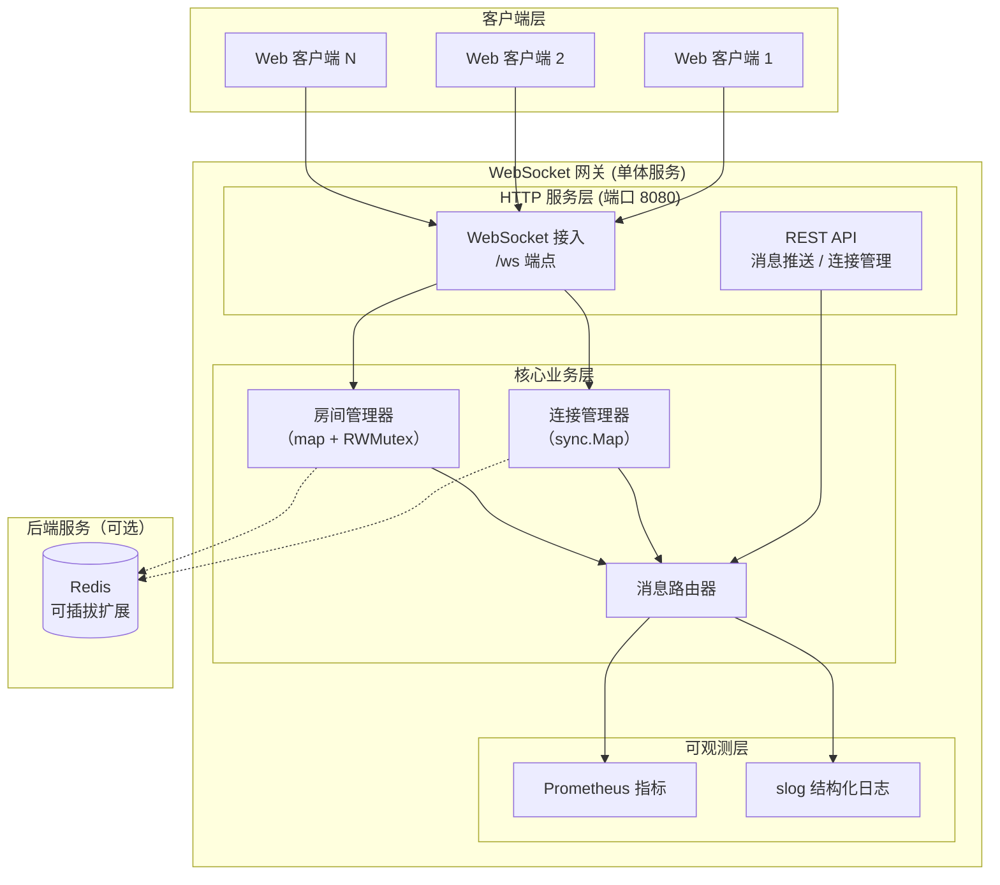
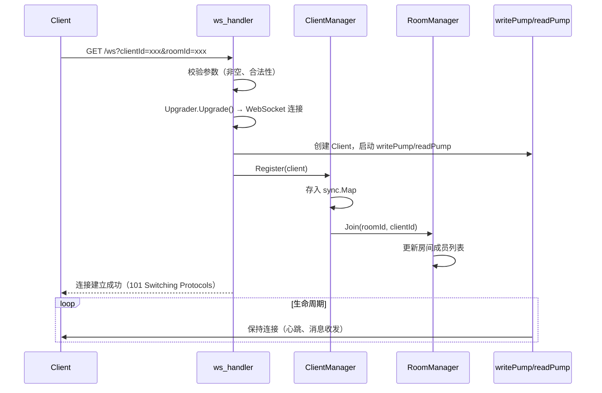
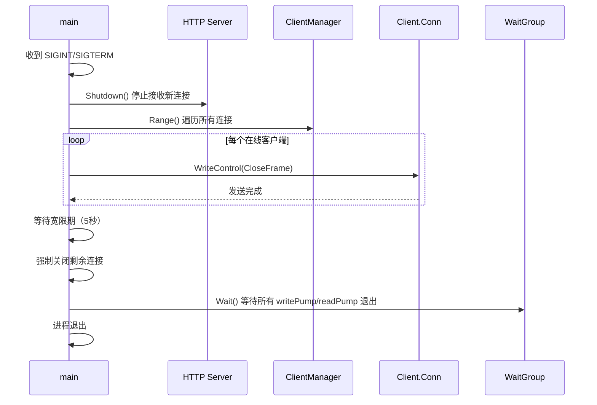

# **Go轻量级WebSocket网关 – 系统设计文档**

---

> **项目名称**：se-go-ws-gateway-2026
> 
> **版本**：v1.0
> 
> **日期**：2026-07-05
> 
> **编写人**: 项目组   

---

[TOC]

---

## 一、系统架构

### 1.1 总体架构图



### 1.2 核心组件说明

| 组件 | 技术选型 | 职责 |
|------|---------|------|
| HTTP 服务 | Gin | 路由注册、请求解析、响应输出；WebSocket 升级端点与 REST 管理接口共用同一端口 |
| WebSocket 接入层 | gorilla/websocket | 负责 HTTP 到 WebSocket 的协议升级，以及帧的读写操作 |
| 连接管理器 | sync.Map | 存储所有在线客户端（`clientId` → `Client`），支持并发安全读写 |
| 房间管理器 | map + RWMutex | 维护房间与客户端 ID 列表的映射关系，支持安全增删查 |
| 消息路由器 | 纯 Go 逻辑 | 实现全服广播、房间广播、单播三种分发策略 |
| 监控指标 | prometheus/client_golang | 暴露连接数、消息计数等指标，供 Prometheus 采集 |
| 日志 | log/slog | 输出结构化 JSON 日志，记录关键事件与性能数据 |

### 1.3 技术选型对比

| 决策 | 理由 | 替代方案 |
|------|------|----------|
| 使用 Gin 作为 HTTP 框架 | 轻量、高性能、中间件丰富，团队成员熟悉度高 | 标准库 net/http（开发效率略低） / gorilla/mux（老师推荐，但团队不熟悉） |
| 使用 gorilla/websocket | WebSocket 实现成熟稳定，社区广泛使用 | nhooyr.io/websocket（较新，生态略小） |
| 使用 sync.Map 存储连接 | 官方并发安全容器，读写分离设计，适合连接池读多写少场景 | 手写 map + RWMutex（更灵活但需自行保证并发安全） |
| 连接模型为 per-goroutine | 充分利用 Go 的并发优势，每个连接独立 Goroutine，隔离性好 | 协程池（连接数增大时可通过池复用控制资源） |
| 使用 channel 进行消息通信 | 符合 Go 的并发哲学，天然支持阻塞/非阻塞发送 | 共享内存 + 锁（易产生竞态，代码复杂度高） |
| 不引入外部数据库 | 网关核心为连接管理，无持久化需求，内存存储足以满足性能目标 | Redis（仅作为可选扩展，不强制） |

---

## 二、模块详细设计

### 2.1 目录结构

```
se-go-ws-gateway-2026/
├── cmd/
│   └── gateway/
│       └── main.go                 # 程序入口，依赖组装，优雅退出
├── internal/
│   ├── config/                     # 配置加载与校验
│   │   └── config.go
│   ├── handler/                    # HTTP 处理层（REST API + WebSocket 升级）
│   │   ├── api_handler.go          # REST API 路由处理（广播/房间/单播/stats）
│   │   └── ws_handler.go           # WebSocket 升级与连接管理
│   ├── service/                    # 核心业务逻辑层
│   │   ├── client_manager.go       # 连接池管理（注册/注销/查找）
│   │   ├── message_router.go       # 消息路由（广播/房间广播/单播）
│   │   └── room_manager.go         # 房间成员管理（增删查）
│   ├── model/                      # 数据结构定义
│   │   ├── client.go               # Client 结构体
│   │   └── message.go              # 消息格式定义
│   └── middleware/                 # 中间件
│       ├── logger.go               # 请求日志中间件
│       ├── recovery.go             # panic 恢复中间件
│       └── ratelimit.go            # 限流中间件（可选，未来扩展）
├── pkg/                            # 可复用公共库
│   ├── metrics/                    # Prometheus 指标封装
│   │   └── metrics.go
│   └── logger/                     # 日志初始化封装
│       └── logger.go
├── configs/
│   └── config.toml                 # 配置文件
├── docs/                           # 文档目录
├── docker-compose.yml
├── Dockerfile
├── .gitignore
├── go.mod
├── go.sum
├── README.md
└── LICENSE
```

### 2.2 数据模型 (`internal/model`)

**Client 结构体**（对应连接管理模块）：

```go
type Client struct {
    ID       string          // 客户端唯一标识
    RoomID   string          // 所属房间 ID
    Conn     *websocket.Conn // WebSocket 连接对象
    Send     chan []byte     // 消息发送通道（缓冲区大小可配置）
    LastPong time.Time       // 最后一次收到 Pong 的时间
    mu       sync.Mutex      // 保护 Conn 的写操作
}
```

**消息格式**（统一 JSON 结构）：

```json
{
  "type": "text",
  "data": "hello world",
  "timestamp": 1234567890
}
```

**统计信息响应**：

```json
{
  "total_connections": 5000,
  "rooms": {
    "room1": 1000,
    "room2": 2000
  },
  "uptime_seconds": 3600
}
```

### 2.3 连接管理器 (`internal/service/client_manager`)

**功能职责**：
- 提供连接注册、注销、按 ID 查找、遍历所有连接的能力
- 内部使用 `sync.Map` 保证并发安全
- 通过 channel 接收注册/注销请求，解耦业务逻辑与底层存储

**关键方法**：

| 方法 | 功能 | 调用方 |
|------|------|--------|
| `Register(client *Client)` | 将客户端加入连接池，同时更新房间成员列表 | ws_handler |
| `Unregister(clientID string)` | 从连接池移除客户端，同时从房间列表中移除 | ws_handler / 心跳超时 |
| `Get(clientID string) (*Client, bool)` | 根据 ID 查找客户端 | message_router |
| `Range(fn func(key, value any) bool)` | 遍历所有在线客户端（供广播使用） | message_router |

### 2.4 房间管理器 (`internal/service/room_manager`)

**功能职责**：
- 维护房间（`roomId`）与客户端 ID 列表的映射关系
- 支持向指定房间获取所有客户端 ID
- 使用 `RWMutex` 保证并发安全

**数据结构**：

```go
type RoomManager struct {
    rooms map[string]map[string]bool  // roomId -> set of clientId
    mu    sync.RWMutex
}
```

**关键方法**：

| 方法 | 功能 |
|------|------|
| `Join(roomID, clientID string)` | 将客户端加入房间 |
| `Leave(roomID, clientID string)` | 将客户端移出房间 |
| `GetClients(roomID string) []string` | 获取房间内所有客户端 ID 列表 |
| `RemoveClientFromAllRooms(clientID string)` | 从所有房间中移除该客户端 |

### 2.5 消息路由器 (`internal/service/message_router`)

**功能职责**：
- 实现三种消息分发模式：全服广播、房间广播、单播
- 所有发送采用 **非阻塞 select** 策略，避免单个慢客户端阻塞整个广播
- 依赖 `ClientManager` 获取连接，`RoomManager` 获取房间成员

**三种分发逻辑**：

| 模式 | 调用方式 | 实现 |
|------|----------|------|
| 全服广播 | `BroadcastToAll(msg []byte)` | 遍历连接池，向每个 Client.Send 通道尝试发送，若通道满则丢弃 |
| 房间广播 | `BroadcastToRoom(roomID string, msg []byte)` | 获取房间成员列表，逐个发送，不存在则返回错误 |
| 单播 | `SendToClient(clientID string, msg []byte)` | 直接通过 ID 查找连接，向 Send 通道发送，失败返回错误 |

**关于非阻塞发送**：每个发送操作使用 `select` 语句，包含 `default` 分支，当通道满时立即返回，不阻塞其他连接的处理流程。此策略确保广播操作的 O(n) 时间复杂度不受单点阻塞影响。

### 2.6 Handler 层 (`internal/handler`)

**2.6.1 WebSocket Handler (`ws_handler.go`)**

负责 `/ws` 端点的请求处理：
1. 解析查询参数（`clientId`、`roomId`），校验非空
2. 使用 `gorilla/websocket.Upgrader` 升级 HTTP 连接
3. 创建 `Client` 结构体（初始化 Send 通道、记录连接信息）
4. 调用 `ClientManager.Register` 注册客户端
5. 启动两个 Goroutine：`writePump`（负责从 Send 通道读取并写入 WebSocket）和 `readPump`（负责读取 WebSocket 消息并处理心跳）

**2.6.2 REST API Handler (`api_handler.go`)**

负责四个管理端点的实现：

| 端点 | 方法 | 功能 | 请求体/参数 |
|------|------|------|-------------|
| `/api/broadcast` | POST | 全服广播 | `{"type":"text","data":"..."}` |
| `/api/room/:roomId/broadcast` | POST | 房间广播 | `{"type":"text","data":"..."}` |
| `/api/client/:clientId/send` | POST | 单播 | `{"type":"text","data":"..."}` |
| `/api/stats` | GET | 获取统计信息 | 无 |

### 2.7 心跳保活机制

**设计原则**：
- 服务端主动发起 Ping 帧，客户端响应 Pong 帧
- 采用 WebSocket 协议内置的控制帧（Ping/Pong），而非业务层心跳消息
- 所有超时参数可配置（通过 `config.toml`）

**实现方式**：
- 每个客户端连接在启动后，由 `readPump` 通过 `SetPongHandler` 注册 Pong 回调，记录 `LastPong` 时间
- 在 `writePump` 中启动一个定时器（默认 30 秒间隔），通过 `conn.WriteControl` 发送 Ping 帧
- 若在超时时间（默认 60 秒）内未收到 Pong，`readPump` 检测到超时后主动关闭连接并触发 `Unregister`

### 2.8 优雅退出

**设计原则**：
- 保证服务关闭时现有连接能够正常完成数据发送
- 避免资源泄漏（Goroutine、文件描述符等）
- 使用 `context` + `sync.WaitGroup` 实现

**流程**：
1. 监听 `SIGINT` 和 `SIGTERM` 系统信号
2. 收到信号后，先关闭 HTTP Server，停止接收新连接（`http.Server.Shutdown`）
3. 遍历所有在线连接，发送 WebSocket Close 控制帧（状态码 1000），告知客户端服务即将关闭
4. 等待一个可配置的宽限期（默认 5 秒），让客户端完成数据接收
5. 强制关闭剩余的连接
6. 使用 `WaitGroup` 等待所有 `writePump` / `readPump` Goroutine 退出
7. 退出主进程

### 2.9 监控与可观测性

**Prometheus 指标**：

| 指标名 | 类型 | 标签 | 说明 |
|--------|------|------|------|
| `ws_active_connections` | Gauge | 无 | 当前在线连接总数 |
| `ws_room_count` | Gauge | `room_id` | 各房间在线人数 |
| `ws_messages_sent_total` | Counter | `type`（broadcast/room/unicast） | 累计发送消息数 |
| `ws_messages_received_total` | Counter | 无 | 累计接收消息数 |
| `ws_connection_events_total` | Counter | `event`（connected/disconnected） | 连接建立/关闭计数 |

**日志**：
- 使用 `log/slog` 标准库，输出 JSON 格式
- 记录连接建立、关闭、心跳超时、消息发送失败等关键事件
- 包含 `clientId`、`roomId`、`error`、`duration` 等结构化字段

---

## 三、接口设计

### 3.1 外部接口

本节仅列出接口概览，详细内容请参见 [接口设计说明书](2-接口设计说明书.md)。

**WebSocket 接入**：

| 端点 | 协议 | 参数 | 说明 |
|------|------|------|------|
| `/ws` | WebSocket | `clientId`, `roomId` | 建立 WebSocket 长连接 |

**REST API**：

| 方法 | 端点 | 说明 |
|------|------|------|
| POST | `/api/broadcast` | 全服广播 |
| POST | `/api/room/:roomId/broadcast` | 房间广播 |
| POST | `/api/client/:clientId/send` | 单播 |
| GET | `/api/stats` | 获取统计信息 |
| GET | `/metrics` | Prometheus 指标端点 |
| GET | `/health` | 健康检查 |

### 3.2 内部接口

| 接口 | 定义 | 职责 | 调用方 |
|------|------|------|--------|
| `ClientManager.Register` | `func Register(c *Client)` | 注册连接 | `ws_handler` |
| `ClientManager.Unregister` | `func Unregister(id string)` | 注销连接 | `ws_handler` / 心跳超时 |
| `ClientManager.Get` | `func Get(id string) (*Client, bool)` | 查找连接 | `message_router` |
| `ClientManager.Range` | `func Range(fn func(key, value any) bool)` | 遍历连接池 | `message_router.BroadcastToAll` |
| `RoomManager.Join` | `func Join(roomID, clientID string)` | 加入房间 | `ClientManager.Register` |
| `RoomManager.Leave` | `func Leave(roomID, clientID string)` | 离开房间 | `ClientManager.Unregister` |
| `RoomManager.GetClients` | `func GetClients(roomID string) []string` | 获取房间成员 | `message_router.BroadcastToRoom` |
| `MessageRouter.BroadcastToAll` | `func BroadcastToAll(msg []byte) error` | 全服广播 | `api_handler` |
| `MessageRouter.BroadcastToRoom` | `func BroadcastToRoom(roomID string, msg []byte) error` | 房间广播 | `api_handler` |
| `MessageRouter.SendToClient` | `func SendToClient(clientID string, msg []byte) error` | 单播 | `api_handler` |
| `writePump` | `func (c *Client) writePump(ctx context.Context)` | 发送协程 | `ws_handler`（启动） |
| `readPump` | `func (c *Client) readPump(ctx context.Context)` | 接收协程 | `ws_handler`（启动） |

---

## 四、数据流设计

### 4.1 连接建立时序图



### 4.2 广播消息时序图

```mermaid
sequenceDiagram
    participant Backend as 业务后端
    participant APIHandler as api_handler
    participant Router as MessageRouter
    participant ConnMgr as ClientManager
    participant Client as Client.Send

    Backend->>APIHandler: POST /api/broadcast
    APIHandler->>APIHandler: 解析 JSON，校验格式
    APIHandler->>Router: BroadcastToAll(msg)
    Router->>ConnMgr: Range() 遍历所有连接
    loop 每个在线客户端
        Router->>Client: select { case Send <- msg; default }
        alt 通道未满
            Client->>Client: 消息进入发送队列（writePump 会处理）
        else 通道已满
            Router->>Router: 丢弃消息，不阻塞（仅记录日志）
        end
    end
    Router-->>APIHandler: 返回成功（部分丢弃不影响整体）
    APIHandler-->>Backend: 200 OK
```

### 4.3 优雅退出时序图



---

## 五、安全设计

| 安全层面 | 措施 | 说明 |
|----------|------|------|
| 参数校验 | WebSocket 升级时检查 `clientId` 和 `roomId` 非空、不含危险字符 | 防止注入式攻击 |
| 限流 | 对 REST API 端点应用限流中间件（令牌桶算法） | 防止恶意高频调用压垮网关 |
| 请求校验 | 对 REST API 请求体进行 JSON Schema 校验 | 拒绝格式错误或缺失必填字段的请求 |
| 连接安全 | 支持通过环境变量启用 WSS（TLS） | 证书由外部提供，增强传输层安全 |
| 错误处理 | 使用 `recover` 中间件捕获 panic，防止单点崩溃影响全局 | 保证服务稳定性 |
| 并发安全 | 所有共享数据结构使用 `sync.Map` 或 `RWMutex` 保护 | 防止数据竞态 |

---

## 六、性能优化

| 优化策略 | 说明 |
|----------|------|
| 非阻塞发送 | 使用 `select + default` 方式向 Client.Send 通道发送消息，避免单个慢客户端阻塞整个广播链路 |
| sync.Map 读多写少优化 | 连接池读操作远多于写操作，使用 `sync.Map` 可充分利用其读写分离特性 |
| 通道缓冲区可配置 | `Client.Send` 缓冲区大小（默认 256）可通过配置文件调整，以适应不同负载场景下的阻塞风险 |
| 心跳间隔可调 | 心跳间隔和超时时间可配置，便于在不同网络环境下调整保活策略 |
| Goroutine 轻量 | 每个连接仅占用 2 个 Goroutine（writePump + readPump），充分利用 Go 的轻量级并发优势 |
| Gin 生产模式 | 设置 `gin.SetMode(gin.ReleaseMode)` 减少框架内部日志开销 |
| 健康检查 | 提供 `/health` 端点，便于负载均衡器检测服务状态，配合容器编排自动摘除异常实例 |

---

## 七、扩展性与维护性

| 维度 | 设计 |
|------|------|
| 分层架构 | Handler / Service 分层清晰，HTTP 处理与核心业务逻辑解耦，便于独立修改和测试 |
| 配置化 | 所有关键参数（心跳间隔、超时时间、通道缓冲区大小、端口等）均通过 `config.toml` 管理，支持环境变量覆盖 |
| Redis 可拔插 | Redis Pub/Sub 扩展作为可选功能，通过环境变量 `REDIS_URL` 激活，不影响核心单机模式 |
| 单元测试 | 核心模块（ClientManager、RoomManager、MessageRouter）可独立编写单元测试，使用 mock 隔离外部依赖 |
| Docker 部署 | 提供 Dockerfile 和 docker-compose.yml，支持一键启动，便于环境迁移和部署 |

---

## 八、部署架构

| 环境 | 配置 | 说明 |
|------|------|------|
| 开发环境 | 本地 `go run` | 使用 `configs/config.toml` 配置，服务监听 `localhost:8080` |
| 测试/压测环境 | Docker Compose | 一键启动网关服务 + 可选 Redis，便于压测和功能验证 |
| 生产环境 | 容器化部署 | 镜像 ≤ 50MB（Alpine 基础镜像），支持 Kubernetes 等容器编排平台 |

**Docker Compose 服务组成**：
- `gateway`：WebSocket 网关服务（主服务）
- `redis`：可选，用于多实例消息广播（通过环境变量开关）

---

## 九、附录

### 9.1 术语表

| 术语 | 说明 |
|------|------|
| WebSocket | 全双工通信协议，基于 TCP，支持长连接 |
| 网关 | 作为客户端与业务后端之间的中间层，负责连接管理与消息路由 |
| 长连接 | 指 WebSocket 连接保持不断开，可持续进行双向通信 |
| 广播 | 将消息推送给所有在线客户端 |
| 房间广播 | 将消息推送给同一房间内的所有客户端 |
| 单播 | 将消息推送给指定的单个客户端 |
| 心跳保活 | 通过周期性 Ping/Pong 帧检测连接是否存活，及时清理无效连接 |
| 优雅退出 | 服务关闭时，先发送关闭帧告知客户端，等待数据发送完成再退出，确保不丢失消息 |
| 非阻塞发送 | 使用 `select` 语句的 `default` 分支尝试发送，若通道满则跳过，避免阻塞主流程 |

### 9.2 设计决策记录

| 决策 | 理由 | 替代方案 |
|------|------|----------|
| 使用 Gorilla/WebSocket | 成熟稳定，社区广泛使用 | nhooyr.io/websocket（较新） |
| 使用 Gin 作为 HTTP 框架 | 开发效率高，团队成员熟悉 | gorilla/mux（需学习） |
| 使用 sync.Map 存储连接 | 并发安全，读多写少场景优化好 | map + RWMutex（更可控） |
| 每个连接两个 Goroutine | 读写分离，避免相互阻塞，代码清晰 | 单 Goroutine 读写复用（复杂度略高） |
| 非阻塞 select 发送 | 防止单点阻塞影响整体广播性能 | 为每个发送启动 Goroutine（资源开销大） |
| Redis 作为可选扩展 | 保持核心轻量，不强制依赖 | 默认内置 Redis 支持（增加复杂度） |

---

**版本记录**

| 版本 | 日期 | 修改说明 |
|------|------|----------|
| v1.0 | 2026-07-05 | 初始版本，基于需求规格说明书与团队讨论制定 |