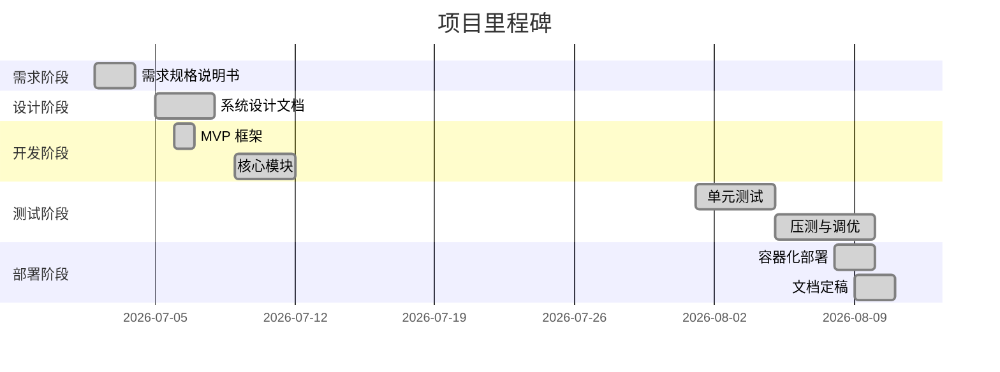

# **Go轻量级WebSocket网关 – 开发进度报告**

---

> **项目名称**：se-go-ws-gateway-2026
>
> **版本**：v1.0
>
> **日期**：2026-08-09
>
> **编写人**：项目组

---

[TOC]

---

## 一、报告概述

本报告记录 Go 轻量级 WebSocket 网关项目的开发进度，涵盖从项目启动、需求分析、系统设计、编码实现、测试验证到部署上线的完整开发周期。报告按阶段汇总已完成的任务、阶段性成果以及各阶段遇到的问题与解决方案。

---

## 二、第一阶段：需求分析与项目准备（第 1 周）

### 2.1 已完成任务

| 日期 | 任务 | 产出 |
|------|------|------|
| 6/29 | 参与实训选题说明会，明确项目目标与要求 | 选定 WebSocket 网关选题 |
| 6/30 | 与指导老师进行组会讨论，明确技术路线 | 确认技术选型与实现路径 |
| 7/1 - 7/2 | 编写软件需求规格说明书 | `2-1软件需求规格说明书.md` |
| 7/3 | 搭建 GitHub 仓库，配置权限与分支策略 | 仓库初始化，`develop`/`main` 分支 |
| 7/4 | 编写 Git 使用规范文档 | `git使用规范文档.md` |
| 7/5 | 初始化项目目录结构，编写技术规范文档初版 | `5-技术规范文档.md` |

### 2.2 阶段成果

- ✅ 完成需求分析，明确 4 类功能性需求（FR-01 ~ FR-04）和 5 类非功能性需求（NFR-01 ~ NFR-05）
- ✅ 确定技术栈：Go 1.26.4 + Gin + gorilla/websocket + slog + Prometheus
- ✅ 建立版本控制规范：分支策略、提交信息格式、代码审查清单
- ✅ 完成系统设计文档初版，包含总体架构和模块划分

### 2.3 遇到的问题与解决

| 问题 | 解决方案 |
|------|----------|
| 团队成员对 WebSocket 协议不熟悉 | 查阅 RFC 6455 规范，参考 gorilla/websocket 官方示例 |
| Git 分支策略讨论耗时 | 采用 GitHub Flow 简化分支模型：`main` + `develop` + `feature/*` |

---

## 三、第二阶段：MVP 框架搭建与核心模块开发（第 2 周）

### 3.1 已完成任务

| 日期 | 任务 | 产出 |
|------|------|------|
| 7/6 | 搭建 Gin 框架，注册 REST API 路由骨架 | MVP 框架可启动 |
| 7/7 | 实现 `ClientManager` 连接管理器 | `client_manager.go` |
| 7/7 | 定义 `Client` 和 `Message` 结构体 | `model/` 包 |
| 7/8 | 整合 `RoomManager` 和 `MessageRouter` 模块 | `room_manager.go`, `message_router.go` |
| 7/9 | 整合 `ws_handler.go`，完成心跳保活机制 | WebSocket 接入与心跳 |
| 7/10 | 汇总代码，整理项目文档，准备答辩 | 项目文档与答辩 PPT |

### 3.2 阶段成果

- ✅ **连接管理器**：基于 `sync.Map` 实现并发安全的连接池，支持注册/注销/按 ID 查找/遍历
- ✅ **房间管理器**：基于 `map[string]map[string]bool` + `RWMutex` 实现房间成员管理
- ✅ **消息路由器**：实现全服广播、房间广播、单播三种推送模式，采用非阻塞 `select` 发送
- ✅ **WebSocket 接入**：通过 `gorilla/websocket.Upgrader` 完成协议升级，参数校验与重复连接拒绝
- ✅ **心跳保活**：Ping/Pong 控制帧机制，支持配置 Ping 间隔和 Pong 超时
- ✅ **REST API 骨架**：`/api/broadcast`、`/api/room/:roomId/broadcast`、`/api/client/:clientId/send`、`/api/stats`
- ✅ **接口设计说明书**：完成 `2-2接口设计说明书.md`

### 3.3 遇到的问题与解决

| 问题 | 解决方案 |
|------|----------|
| Git merge 冲突频繁 | 约定每次开发前先 `git pull develop`，减少冲突 |
| 心跳超时参数需要灵活配置 | 引入 `config.toml` 配置文件，支持环境变量覆盖 |
| `gorilla/websocket` 的 `WriteControl` 超时设置 | 统一使用 `cfg.ControlWriteTimeout()` 控制所有控制帧写入 |

---

## 四、第三阶段：功能完善与测试（7/15 - 8/5）

### 4.1 已完成任务

| 阶段 | 任务 | 产出 |
|------|------|------|
| 7/15 - 7/17 | 实现优雅退出机制 | `ClientManager.Shutdown` + 信号捕获 |
| 7/22 | 集成 Prometheus 监控指标 | `/metrics` 端点，5 类核心指标 |
| 7/24 | 实现限流中间件（令牌桶） | `ratelimit.go`，挂载到 `/api` 路由组 |
| 7/26 - 7/28 | 完善边界功能和 Bug 修复 | 多个 fix 提交 |
| 7/28 | 编写测试计划初版 | `7-测试计划.md` |
| 7/29 - 8/1 | 编写单元测试 | 7 个模块，覆盖率 82.9% |
| 8/1 - 8/5 | 集成测试与性能压测 | 测试报告、压测数据 |

### 4.2 阶段成果

- ✅ **优雅退出**：捕获 SIGINT/SIGTERM，发送 1000 关闭帧，等待宽限期（5 秒），强制清理
- ✅ **Prometheus 监控**：5 类指标（连接数、发送总量、发送失败、连接事件、接收总量）
- ✅ **限流防护**：基于 IP 的令牌桶限流（默认 12 秒 5 个令牌）
- ✅ **结构化日志**：统一使用 `slog` JSON 格式输出，支持日志级别配置
- ✅ **单元测试**：7 个模块全部 PASS，核心模块覆盖率 ≥ 80%
- ✅ **集成测试**：21 项 IT 用例全部通过
- ✅ **性能测试**：2000 并发 P99 39.01ms，5000 并发 P99 59.38ms，HTTP QPS 50,260

### 4.3 遇到的问题与解决

| 问题 | 解决方案 |
|------|----------|
| 压测工具 `loadtest` 在连接建立后卡死 | 在 `Dial` 成功后立即 `wg.Done()`，不等待 `ReadMessage` 循环 |
| Windows 下 500 并发连接失败 | 压测工具增加 1ms 人为延迟，平滑连接到达，避免 Accept 队列溢出 |
| 限流影响吞吐量测试 | 性能测试期间临时移除限流中间件，测试完成后恢复 |
| `gin.Default()` 日志中间件高并发下性能下降 | 改用 `gin.New()` + `gin.Recovery()`，移除日志中间件 |

---

## 五、第四阶段：部署与文档完善（8/6 - 8/9）

### 5.1 已完成任务

| 日期 | 任务 | 产出 |
|------|------|------|
| 8/6 | 完善最终代码版本，提取常量、优化注释 | `constants.go`，代码规范统一 |
| 8/7 | 用户验收测试（UAT） | `11-用户验收测试计划.md`、`12-用户验收测试报告.md` |
| 8/8 | 编写部署计划，完成 Docker 容器化部署 | `13-部署计划.md`、`14-部署报告.md`、`Dockerfile`、`docker-compose.yml` |
| 8/9 | 完善 README.md、用户手册、系统设计文档、技术规范文档 | 所有文档定稿 |

### 5.2 阶段成果

- ✅ **代码最终版本**：消除魔法数字，统一使用常量；完善所有导出符号注释；移除 `gin.Default()` 日志中间件
- ✅ **用户验收测试**：21 项 FT 用例全部通过，6 项 PT 用例全部通过，4 项 ST 用例全部通过
- ✅ **容器化部署**：多阶段构建镜像 34.9MB；Docker Compose 编排网关 + Prometheus；健康检查验证通过；回滚测试通过
- ✅ **文档体系完整**：需求、设计、接口、计划、报告、手册等 10+ 份文档全部完成

### 5.3 遇到的问题与解决

| 问题 | 解决方案 |
|------|----------|
| `docker-compose.yml` 中 `version` 字段过时警告 | 删除 `version: '3.8'` 行 |
| 优雅退出 INFO 日志仍输出 | 将 `config.toml` 日志级别改为 `error` |
| `GIN_MODE` 未设置导致 debug 日志输出 | 在 `docker-compose.yml` 中添加 `GIN_MODE=release` 环境变量 |

---

## 六、进度总览

### 6.1 任务完成统计

| 阶段 | 计划任务 | 完成任务 | 完成率 |
|------|----------|----------|--------|
| 需求分析与准备 | 6 项 | 6 项 | 100% |
| MVP 与核心模块 | 8 项 | 8 项 | 100% |
| 功能完善与测试 | 12 项 | 12 项 | 100% |
| 部署与文档 | 8 项 | 8 项 | 100% |
| **总计** | **34 项** | **34 项** | **100%** |

### 6.2 里程碑

---

## 七、待解决问题与后续计划

### 7.1 已解决的问题

所有开发过程中发现的问题均已解决，详见各阶段记录。

### 7.2 后续优化方向

| 方向 | 说明 | 优先级 |
|------|------|--------|
| Redis 多实例扩展 | 当前为单机部署，后续可启用 Redis Pub/Sub 实现水平扩展 | 中 |
| 日志采集系统 | 当前仅使用 Docker 日志驱动，后续可接入 ELK 实现集中式日志管理 | 低 |
| Kubernetes 部署 | 当前为 Docker Compose，后续可迁移至 K8s 实现弹性伸缩 | 低 |

---

**版本记录**

| 版本 | 日期 | 修改说明 |
|------|------|----------|
| v1.0 | 2026-08-09 | 初始版本 |